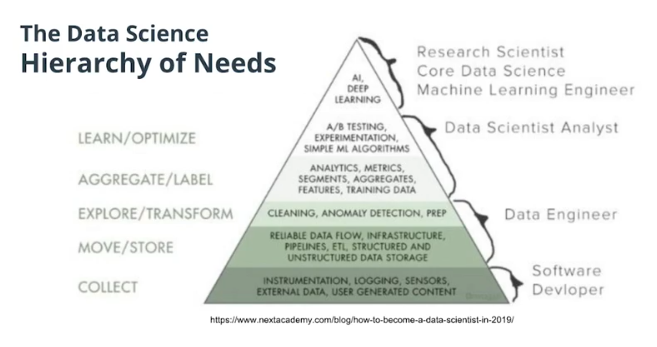
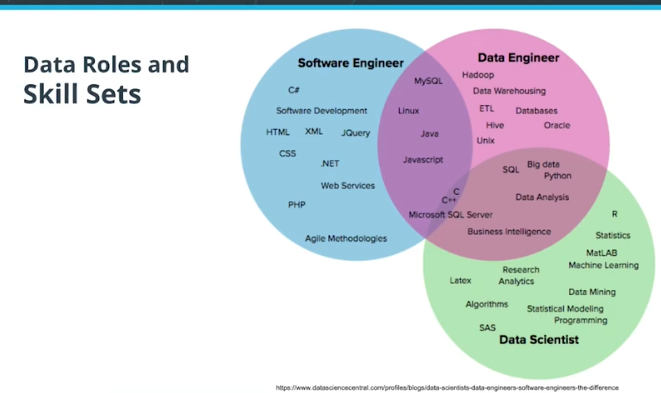

# 01-Welcome
_Udacity - Data Engineering Nanodegree_

## Projects
### Data Modeling
In this project, you’ll model user activity data for a music streaming app called Sparkify. The project is done in two parts. You’ll create a database and import data stored in CSV and JSON files, and model the data. You’ll do this first with a relational model in Postgres, then with a NoSQL data model with Apache Cassandra. You’ll design the data models to optimize queries for understanding what songs users are listening to. For PostgreSQL, you will also define Fact and Dimension tables and insert data into your new tables. For Apache Cassandra, you will model your data to help the data team at Sparkify answer queries about app usage. You will set up your Apache Cassandra database tables in ways to optimize writes of transactional data on user sessions.

### Cloud Data Warehousing
In this project, you’ll move to the cloud as you work with larger amounts of data. You are tasked with building an ELT pipeline that extracts Sparkify’s data from S3, Amazon’s popular storage system. From there, you’ll stage the data in Amazon Redshift and transform it into a set of fact and dimensional tables for the Sparkify analytics team to continue finding insights in what songs their users are listening to.

### Data Lakes with Apache Spark
In this project, you'll build an ETL pipeline for a data lake. The data resides in S3, in a directory of JSON logs on user activity on the app, as well as a directory with JSON metadata on the songs in the app. You will load data from S3, process the data into analytics tables using Spark, and load them back into S3. You'll deploy this Spark process on a cluster using AWS.

### Data Pipelines with Apache Airflow
In this project, you’ll continue your work on Sparkify’s data infrastructure by creating and automating a set of data pipelines. You’ll use the up-and-coming tool Apache Airflow, developed and open-sourced by Airbnb and the Apache Foundation. You’ll configure and schedule data pipelines with Airflow, setting dependencies, triggers, and quality checks as you would in a production setting.

### Data Engineering Capstone
The capstone project is an opportunity for you to combine what you've learned throughout the program into a more self-driven project. In this project, you'll define the scope of the project and the data you'll be working with. We'll provide guidelines, suggestions, tips, and resources to help you be successful, but your project will be unique to you. You'll gather data from several different data sources; transform, combine, and summarize it; and create a clean database for others to analyze.

## Prerequisites
### Python
- Define functions
- Use loops and conditional statements
- Write and use classes in your functions
- Work with various data structures
- Use data-related libraries, like NumPy and Pandas for ETL purposes
- Read and parse CSV and JSON file formats

### SQL
- Write advanced SQL join functions
- Aggregate data
- Write subqueries

### CLI
- Navigate through folders and files
- Run scripts from the command line
- Install packages

### Github
- Create + Clone repos
- Make commits to repo

## Additional Resources
You can find the following courses in the extracurricular section, if you would like to brush up on the above skills.
- Intro to Python
- SQL for Data Analysis
- Command Line Essentials
- Git and Github

`NOTE: My SQL skills might need brushing up to be good at this. Consider checking out the SQL for Data Analysis course for a refresher`

## Career Services from Udacity
Udacity offers career services throughout the course - I should take advantage of these.

`NOTE: They offer CV, cover letter, LinkedIn, and GitHub review.
I would especially like help with GitHub and LinkedIn.`

`PLAN: I will progress through the course a bit, add extra relevant details to my LinkedIn profile + GitHub repo. Then I will ask for a consultation (i.e., no point in gettin a consultation if I haven't done my side of the work yet).`

## General Advice
- Take notes!!
- Write the code yourself; don't copy+paste
- Manage your time
  - Set expectations of when I learn and hold myself to those times
- Getting stuck
  - There is a community on Udacity for helping out with difficult tasks; I can take advantage of this
    - https://udacity.zendesk.com/hc/en-us/community/topics
    - Also look around this community to find topics you can help with
  - There is technical mentor help available on most lessons.
  - Get good at Googling!
  - Be patient with yourself

## Plaigarism
- Don't look at others' solutions before you finish your solution
- If you do use someone else's code in your project (if you get stuck), then:
  - The code you use MUST NOT be directly related to the concepts being taught (you can use helper code, not core code)
  - Ensure you always cite the source (URL) and date the code was found.

---

## Introduction to Data Engineering
It's all about making data available and *ready for analysis (e.g., by machine learning, analysts)*

 ### Day-in-the-life w. Ben Goldberg
 1. Opening up Airflow to see pipeline status
    1. (i.e., monitoring to see failures)
 2. Build data pipeline with Airflow  or writing a query with Spark
    1. "Most of my day is writing code"
 3. Difficulties
    1. Lots of different data sources + qualities
       1. (i.e., getting legacy data to work with modern data)
 4. Advice
    1. Don't get too lost in the tools and acronyms; dive into just a few names
       1. Really get to know Spark, Airflow, S3, Redshift, for example, than trying to learn too many things
       2. It's better to be specialized than to be a generalist.
    2. Important soft skills
       1. Figuring out what data consumers actually need

### Some Readings
- https://medium.com/analytics-and-data/on-the-evolution-of-data-engineering-c5e56d273e37
  - Notes:
    - Hadoop being open-sourced in 2006 helped scale big data infrastructure (it's a non-traditional RDBMS)
    - Airflow (Airbnb) and Luigi (Spotify) emerged as data orchestration engines - able to interface with different systems to deliver data
    - Python became more popular to use in Data Engineering, partially due to communities like [PyData](https://pydata.org/). Improvements to SciKitLearn also enabled easier ML modeling. The release of Spark's MLlib for Python further bridged the gap
      - MLlib is an API which allows the distribution of spark jobs across multiple machines
        - Spark is a system of data processing which can scale across multiple VMs and is optimized for iteration. It can also run locally, just not very scalably.
    - AWS launched in 2006
      - Note: S3 is built on Hadoop
      - Athena (2016) allow querying of S3 data without setting up an AWS cluster
  - Notes:
    - 
- Extra stuff that Kevin found:
  - https://maximebeauchemin.medium.com/functional-data-engineering-a-modern-paradigm-for-batch-data-processing-2327ec32c42a
    - Notes:
      - All about functional programming in Data Engineering
        - Note: From first glance, this makes a lot of sense. Why should jobs be dependent on state? ("In functional code, the output value of a function depends only on the arguments that are passed to it...eliminating side effects")
      - Cool idea: when editing data tables, side effects can be hard to circumvent (e.g., if I DELETE or UPDATE a table, that could have effects later in the program). One solution to this is to partition the table into discrete chunks that can be processed independently (aggregation functions might not work, but iterative row-based processing would - and could then be parallelized).
        - So, when editing a big table, you could first partition it, perform operations on each partition and then UNION ALL.
      - Another cool idea: The code should always work for past use cases. For example, if data aggregation strategy changes for all data later than 2018, the code must still be able to re-create 2017 and earlier tables (just using conditional logic to determine which rules to apply)