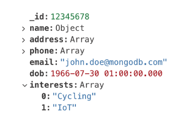
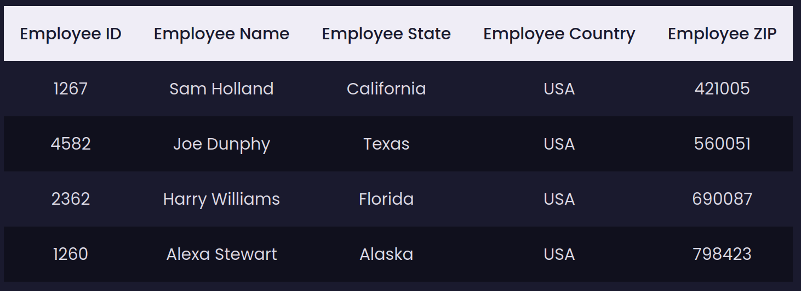
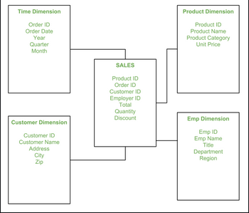
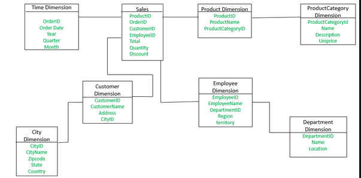

# 02-Data Modeling
_Udacity - Data Engineering Nanodegree_

## Contents
- Differences between relational and Non-relational databases
- How to create relational data models using **Postgres SQL**
- How to create Non-relational data models using **Apache Cassandra**

---
### Database Management Systems (DBMS)
- *[Intro to DBMS](https://www.geeksforgeeks.org/introduction-of-dbms-database-management-system-set-1/)*
  - Notes:
    - DDL = "Data Definition Language", which is the language which deals in commands for altering the structure of the database
      - CREATE, ALTER, DROP, TRUNCATE, COMMENT, REANAME
    - DML = "Data Manipulation Language", which is the language which deals in commands for working with the actual data
      - SELECT, INSERT, UPDATE, DELETE, MERGE, CALL, EXPLAIN PLAN, LOCK TABLE

---
### ACID in database development
#### Atomicity
Transactions (e.g., writing, deleting) either completely **fail** or completely **succeed**. There is no possibility for only half of a job to succeed.
- This is helpful because it means that it is easier to track the status of the database. If a job fails, you know that nothing worked - and you can retry.

#### Consistency
Data has rules applied to it - the type, length, whether it's writable, etc. Whatever rules you apply should closely mimic the reality you are trying to represent (e.g., weight values should never be less than 0).
- By *appropriately* constraining the way data should behave in your database, you can enforce consistency- where any actions which would violate your rules are rejected.

#### Isolation
This involves database locking. Isolation ensures that two operations can NOT occur concurrently in a way which could produce an interaction effect (e.g., writing and deleting to a single table concurrently).
- The interaction effects could be difficult to predict depending on how the DBMS is implemented and what else happening at runtime on the machine. Running the same command twice could therefore produce different results on different machines, SQL implementations, or times if isolation is not enforced.

#### Durability
Changes made to the system are persistent - there are measures in place (e.g., backups) to ensure that data, once inputted or altered, is not lost arbitrarily.

---
## Data Modeling Overview
Data modeling is the process of working out how data will flow - and be stored - in a particular application. Like other sorts of planning, this usually involves first gathering requirements and conceptually mapping (e.g., making a diagram) of the data flows in the application.

`Note: it's helpful when data modeling to test your model with use cases (e.g., when a customer makes a purchase, how will data flow?). This can help ensure that your model is able to respond appropriately - that data is being written, read, and processed managably. `

**Terms**
- Conceptual Data Modeling = making your diagram of how data is stored & relates to itself
- Logical Data Modeling = Planning (on paper) how your conceptual model could be implemented in a general DBMS (think of schemas & exact relationships between tables/objects)
- Physical Data Modeling = Actually writing the code to implement your logical model in a DBMS

`Note: We can think about designing our data model to optimize for various use cases. A programmer might want to write to as few tables as possible for a particular transaction - to speed up the process. An analyst might also want all of their data in one place with as simple (or as adaptable) a query as possible. Also, we could try to think about how best to represent the data according to what real-world process we are actually trying to replicate / emulate (e.g., when setting up ecommerce, let's look at the order forms, warehouse, customers, etc. to see how this has been done non-digitally and see if we can replicate that digitally.`

---
## Relational vs. Non-relational Databases

---
### Relational DBs
- Organizes data into tables with columns and rows
- Unique keys identify each row
- a single row can be thought of as a Tuple (ordered set of data)
- Generally each table represents a SINGLE entity type (makes the RDBMS more scalable, generally)
- Data model is standardized (you know what the data will look like without needing to query it first)
- Flexible in adding / altering tables
- **Generally use SQL for accessing data and interacting with the database system**

**When to use RDBMS**
- Ability to combine data across multiple tables (joins)
- Ability to do aggregations & analytics
- Ability to do ad hoc queries allows you to change business requirements relatively easily (e.g., adding new tables, columns, querying something you didn't expect)
  - NoSQL doesn't allow just any type of querying - you have to know how you will query from the beginning.
- ACID is enforced, meaning that subsequent queries always have the most up-to-date information (NoSQL databases are consistent eventually, but prioritize speed over isolation)
  - **NOTE: MongoDB is one exception that can support ACID transactions**
    - MongoDB

---
### Non-relational DBs
- Non-relational databases are (typically) distributed databases. They can store information across multiple machines. This is in contrast to a RDBMS where all records have to 'live' under a single roof.
- Whereas RDBMS' can only add complexity / records by adding to a single existing machine, Non-relational databases can add more machines.
- Enforcing ACID is sub-otptimal for runtime. Non-relational doesn't enforce ACID, and so can run faster.
- Records can differ from one another in Non-relational (i.e., they can have different rows)

**Types of Non-relation (NoSQL) databases**
- Apache Cassandra
  - Data is still organized in rows + columns, but the tables are **partitioned** across multiple nodes.
- MongoDB
  - Data is organized as documents (independent files). Querying can search for titles of documents *as well as the contents of those documents.*
    - MongoDB's document structure essentially means that records are stored completely in one hierarchical JSON-like structure like this:
    
    - [MongoDB ACID White Paper](https://webassets.mongodb.com/MongoDB_Multi_Doc_Transactions.pdf?_ga=2.221758296.1324186602.1656439253-1203746384.1656439251)
- DynamoDB
  - "Key-value store"
    - So basically like a Dict/JSON?
- Apache HBase
  - "Wide Column Store"
  - Also uses tables, rows + columns, but the columns can vary between rows (kind of like independent entries)
- Neo4J
  - "Graph Database"
  - Somehow focuses on relationships between data (not sure what exactly this means yet)

---
### CAP Theorem
The CAP Theorem (or Brewer's Theorem) says that in a partitioned system, there is a trade-off between consistency and availability, where:
- Consistency = Every read receives the most recent write OR an error
- Availability = Every request receives a non-error response, but it's not guaranteed it's the most recent write

Note: I think this is because partitioned systems that can be reading and writing to multiple copies of the data simultaneously. When a read request comes in, the system can either choose to prioritize **eventual consistency** (i.e., making sure the system is entirely updated) or **availability** (i.e., returning the local value- without waiting for confirmation from the rest of the system that this value is the most up-to-date).

*Note from Udacity instructor: the tradeoff between consistency and availability is most relevant for partitioned (vs. non-partitioned) systems because partitioned systems can experience network failure between nodes. In these situations, the node being queried must decide whether to give errors until the connection is re-established or to give the local values, which may not be consistent.*

The PACELC Theorem expanded on CAP by noting that even in the absence of a partitioned systems, a trade-off exists between consistency and **latency** (not sure what this really looks like in a traditional SQL DBS though - maybe since most of them are designed to never sacrifice consistency)

*Interesting note: Blockchain technology prioritizes availability- by requiring a certain number of 'confirmations', but not waiting for confirmations from all systems*

---
### Introduction to Apache Cassandra
**Glossary**
- Keyspace = collection of tables
- Table = group of partitions
- Partition = Collection of rows
- Primary key = Partition key (which partition) and chosen uniquely-identifying "clustering column(s)"
- **Partition key = responsible for data distribution across your nodes**
- **Clustering key = responsible for data sorting within partitions**
- Row = a single 'item' (?)

Apache Cassandra is a distributed database. It runs on a group of 'nodes' (VMs, servers, docker containers) and parts of the data are distributed across these nodes.

Additionally, in order to ensure uptime, data is not only *distributed* across nodes, but also *replicated* to a certain extent - safeguarding against the eventuality that nodes will go down occasionally.

This system of having data replicated across multiple nodes means that it's not possible to update data in all locations simultaneously. So an UPDATE or INSERT statement might affect one node immediately, but it will take time for that change to be reflected across all copies of the data across all nodes. This is called **Eventual Consistency**.

**Eventual Consistency**
  - 'If no new updates are made to a given data item, eventually all accesses to that item will **eventually** return the last updated value (but maybe not **immediately**).
    - Note: So it takes a moment to update all of the nodes? In that case, it's just how long that takes which determines if it's practically cause for concern.

with NoSQL databases (such as Cassandra) it's not possible to query on a completely ad hoc basis.
Instead of simply creating a table to best represent the data, you have to **create the table to best respond to the queries
you intend to use**. This is because the table will be distributed across several nodes - so you have to tell Cassandra how
to split the data so it can respond to your queries well.

Similarly, Cassandra does not (by default at least) allow SELECT statements which do not have a WHERE clause. The reason for disallowing this is to prevent the user from trying to scan too much data - which could bring down the system. There's no reason to NOT have a WHERE clause for most use cases though.

Cassandra organizes data across partitions and **within** partitions by using **composite primary keys**.

---
#### Partition + Clustering keys in Cassandra
When defining composite primary keys in Cassandra:
1. The first attribute named is the **partitioning key** ('year' in the example below). This defines how data will be split across Cassandra nodes
2. Any attribute(s) listed after the partitioning key is the **clustering key** ('artist' in the example below). This defines how data will be sorted within partitions

```
CREATE TABLE IF NOT EXISTS music_years
(year int,
artist text,
album text,
PRIMARY KEY (year, artist, album))
```

**Note:** It's also possible to create composite partition or clustering keys by using parentheses (e.g., `PRIMARY KEY ((year,artist),album)` will partition data by unique combinations of 'year' and 'artist').

It's quite important to particularly choose **partition keys** carefully because this will have a large impact on the eventual performance of your database.
Some rules of thumb from [this source](https://opensource.com/article/20/5/apache-cassandra):
- Aim for partitions of 10mb or less, with an absolute maximum of 100mb
- Partitions should not be permitted to grow in an unbounded way. Enforce this through partition keys
  - For example: partitioning session logs by datetime will ensure that individual partitions cannot grow infinitely. However, partitioning session logs by market means that partitions could grow limitlessly.

Some other notes about using WHERE, SORT, or GROUP BY statements:
- When querying Cassandra, keep in mind that you can only use WHERE, SORT, or GROUP BY statements for attributes which are part of the composite primary key. If you want to use attributes for these statements, they must be part of this composite key.
- The **order of keys** in the composite key is also important. You can only use attributes for these statements *in the same order you specified them in the key*
  - For example, in the primary key `PRIMARY KEY (year (artist, album))`, the statement `WHERE year = 1970 AND album = "Greatest Hits"` **WILL NOT WORK**. This is because 'album' is specified 3rd in the composite key. We would need to include 'artist' as part of our filtering statement before we are allowed to use 'album'

[More info on partition, clustering keys](https://stackoverflow.com/questions/24949676/difference-between-partition-key-composite-key-and-clustering-key-in-cassandra)

#### Denormalization in Apache Cassandra
Because there are no joins in Apache Cassandra, denormalization (whereby you ensure that queries only have to use 1 table) is necessary. **So you need to consider queries first when designing your Apache Cassandra data model**

Udacity Instructor: "One table per query is a good model"
**Question:** Since we need to make a new table per query, there will be pressure to say "why don't we include *more* columns than we need for X query, just in case... How do we balance between adding ALL of the columns (covering every possible use case) and having so few columns that our tables can't adjust even for minor query changes?


**Helpful links**
- [Keys + Clustering Cols in Cassandra](https://www.bmc.com/blogs/cassandra-clustering-columns-partition-composite-key/)
  - Notes:
    - Cassandra sorts by clustering columns (for fast retrieval)
    - Cassandra is specifically optimized for *writing* data
- [How to understand Cassandra Architecture](https://docs.datastax.com/en/archived/cassandra/3.0/cassandra/architecture/archTOC.html)
  - Notes:
    - Cassandra is setup to prioritize availability. Its distributed nature lowers the chance that the data being queried is unavailable (relative to non-distributed databases)
    - The nodes communicate their state information on a regular basis (I'm guessing basic information is whether changes have been made or not). Note: In a distributed system, no comms might mean a lost connection OR no new information, so consistent communication even when no changes are registered might be required.
    - Nodes maintain sequentially-written change logs
    - Data is written to in-memory structures called 'memtables' which, when full, write to disk-based SSTable files.
    - Cassandra periodically 'consolidates' SSTables through a process called compaction, discarding obsolete (overwritten?) data.
    - Cassandra employs various repair mechanisms to ensure data across the cluster stays consistent.
    - Cassandra is row-based, and rows are organized into tables and partitioned.
    - **CASSANDRA DOES NOT ALLOW JOINS ON TABLES** Tables must be designed so that they satisfy the needs of queries on their own. New queries might mean creating entirely new tables (normalization is fully sacrificed)
    - each node is capable of receiving requests. When one does, it assumes the role of **coordinator** and dictates how many other nodes are called.
    - The 'replication factor' is a measure of how many times data is replicated across the system, where '2' means the data has exactly 2 copies
    - Cassandra is particularly optimized for fast writes.
- [Tutorialspoint - Cassandra Architecture](https://www.tutorialspoint.com/cassandra/cassandra_architecture.htm)

---
## Relational Data Models
**Terms**
- Fact / dimension tables
- OLAP queris vs. OLTP queries
  - OLAP queres= Online Analytical Processing; databases optimized for **reading**. These databases allow complex aggregations
    - e.g. "How many customers from Bruges visited our site between 9:00 and 12:00 yesterday?"
  - OLTP queries = Online Transactional Processing; databases optimized for "less complex queries in large volume"
    - e.g. "What's the price of the new Nike Jordans in our shop?"

### Relational Database Normalization / Denormalization
- Normalization vs. denormalization
  - Normalization = Reducing data redundancy, improving integrity
  - Denormalization = Making data redundant, improving query response time
#### Normal Forms (First, Second Third)

**First Normal Form (1NF)**
- Each cell contains unique and single values
  - e.g., a table with a cell "kevin_stine_DataEngineer" is storing first name, last name, and profession in a single cell. This violates 1NF.
- Be able to add data without altering tables
  - (I'm a bit unclear on what this one means)
- Separate different relations into different tables
  - e.g., if you have n songs for an album (1:many relationship of unknown length), it's better to make another table for songs rather than storing a list of songs as a column in the album table.

**Second Normal Form (2NF)**
- Have 1NF
- Has no 'partial dependencies' - for example, in the table below, 'Teacher Age' is dependent on 'Teacher ID', but 'Teacher Age' cannot be used as a key value (since it could be non-unique). This table needs to be split - so that Teacher ID is in 2 tables with subject and age respectively.


**Third Normal Form (3NF)**
- Have 2NF
- Doesn't have 'transitive dependencies'
  - e.g. if A is dependent on B and B is dependent on C, A is transitively dependent on C.
  - In the following example, Zip code is dependent on employee ID. But then State and country are dependent on Zip code, therefore state and country are dependong on employee ID - which doesn't make much sense.



#### Denormalization
Denormalization is the reversal of the normalization tradeoffs. Normalization minimizes redundancy and optimizes data integrity, at the cost of performance (table joins are expensive; data can only be read from 1 place). Denormalization re-introduces redundancy to make querying faster, although maintaining data integrity becomes more difficult.

A basic example of denormalization is where we notice that 2 tables are being joined for most of the queries we do, so we decide to duplicate data across those 2 tables so that our queries can just use 1 table.

`Note: There wasn't much explanation in the course about how to do this in a sustainable way. However, it seems clear that the extent to which you decide to de-normalize should (a) be dependent on the exact queries you want to optimize and (b) come with a plan for maintaining data integrity (which becomes more complicated in de-normalized tables`

### Fact & Dimension Tables
Fact & dimension tables are created the same as other tables in the DDL when the database schema is created, but are used differently from each other

**Fact Tables**
Fact tables represent **static information** about the relationships between tables.
For example, the table below shows that specific Orders were made on a certain date, with certain products, and certain quantities. These data will not change - these things happened. This is in contrast to *dimension tables* which give us useful information about these relationships (e.g., the name of the product, the cost of the product, etc.).

| Date_id | Store_id | Product_id | Product_quantity |
| --- | --- | --- | --- |
| 1023454 | 001 | 02993 | 23 |
| 1023332 | 001 | 02991 | 6 |

**Dimension Tables**
Dimension tables give us the additional information we need to make sense of the fact table. For example, we can JOIN the fact table to the 'store' dimension table to give us more information about the store's location

| Store_id | Creation_date_id | Customer_Id | Order_quantity |
| --- | --- | --- | --- |
| 1023454 | 001 | 02993 | 23 |
| 1023332 | 001 | 02991 | 6 |

#### Star Schema
A star schema is a type of database modeling where a single fact table exists at the center of multiple dimension tables (in a star-like shape). The entire database can be made out of multiple 'stars'
i.e., A single fact table is used as the reference for all dimension tables.



`Notes: Star schemas are apparently 'de-normalized', but I don't see that yet. Is it because things like the 'Customer Dimension' above where we have transitive dependencies (i.e., city dependent on zip, zip dependent on customer)? If so, then why not still split those into other tables? Do star schemas not allow intermediate tables (i.e., EVERYTHING MUST be connected to star schema)?`

#### Snowflake Schema
A snowflake schema is an extension of the star schema. Related to the star schema:
- Snowflake schemas can represent 1:n (one-to-many) relationships
- Snowflake schemas can be more normalized (but sometimes still not 3NF)



**Extra Reading**
- [Codd's 12 Rules on what makes databases relational](https://en.wikipedia.org/wiki/Codd%27s_12_rules)
  - Note: Not really sure yet how these rules are applied / discussed practically - seems more granular than ACID.

---

## NON-Relational Data Models

### Denormalization
In relational databases, you can de-normalize the data (as in star schemas) to optimize certain types of querying.

### Document stores
Document stores - such as MongoDB and Firestore - store literally files of data. These files can contain any text-based information, such as logs, nested JSON, YAML, etc. Files all have keys and are indexed (sometimes according to document metadata to enhance document lookup).

### Graph Databases
Graph databases - such as Amazon Neptune - store objects that have properties. These properties can describe relationships with *other objects* and objects can have variable schemas. The result is a collection of objects each representing an entity and each with relationships to other objects. This setup prioritizes the relationships between objects rather than aggregations over object properties themselves (like a relational database might).

### Columnar databases
Columnar databases are still tabular databases, but they store data as columns rather than as rows (maybe like the 'Parquet' files of the database world). These include Google BigTable, Apache Cassandra, AWS Redshift, and many others. The advantage of these systems is that extraction of singular columns of data for analysis is very fast - since they require fewer I/O operations and reduces the amount of disk data necessary to load [according to AWS](https://aws.amazon.com/nosql/columnar/)

### Key-value stores
Key-value stores like AWS DynamoDB store data as keys and then 'blobs' of data attached to those keys as values.
They are intended for applications that *only ever use the primary key to look up a record* [according to AWS](https://aws.amazon.com/nosql/key-value/) - such as a web application that needs to find sessions based on their keys. Schemas are defined per-item so they can be highly flexible.