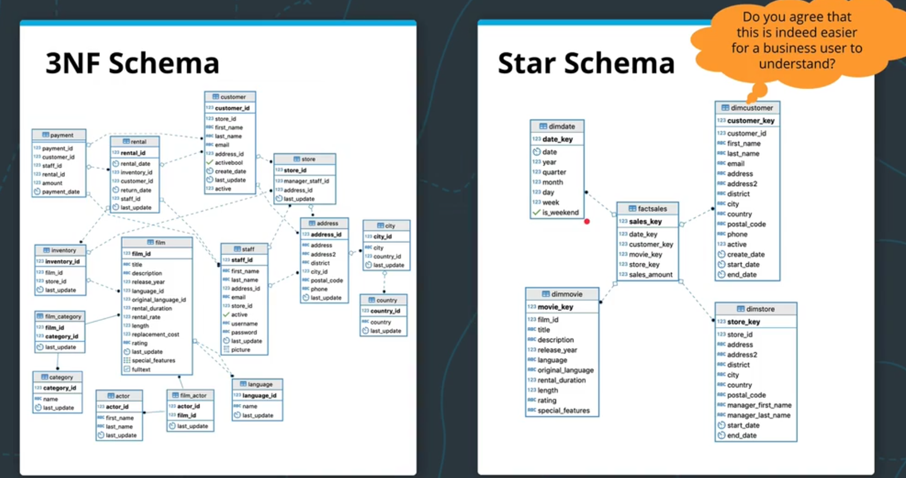
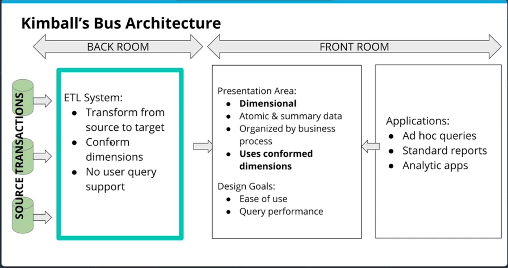
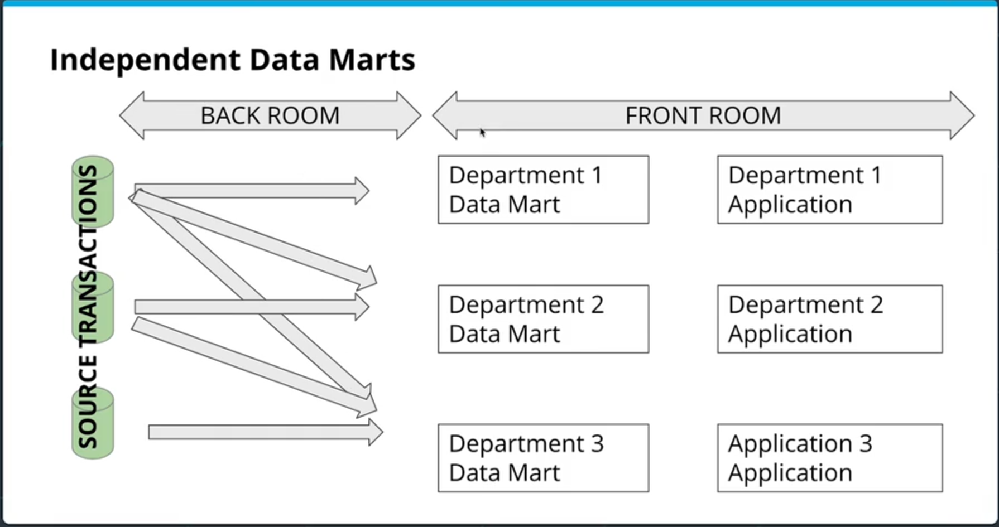
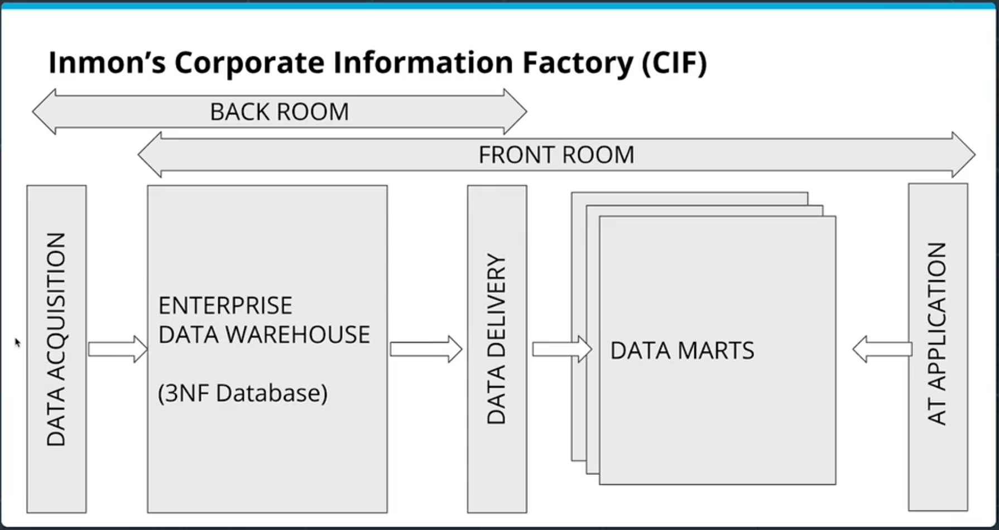
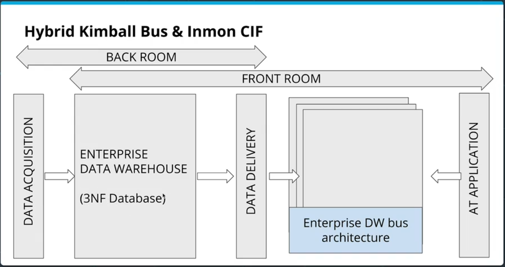
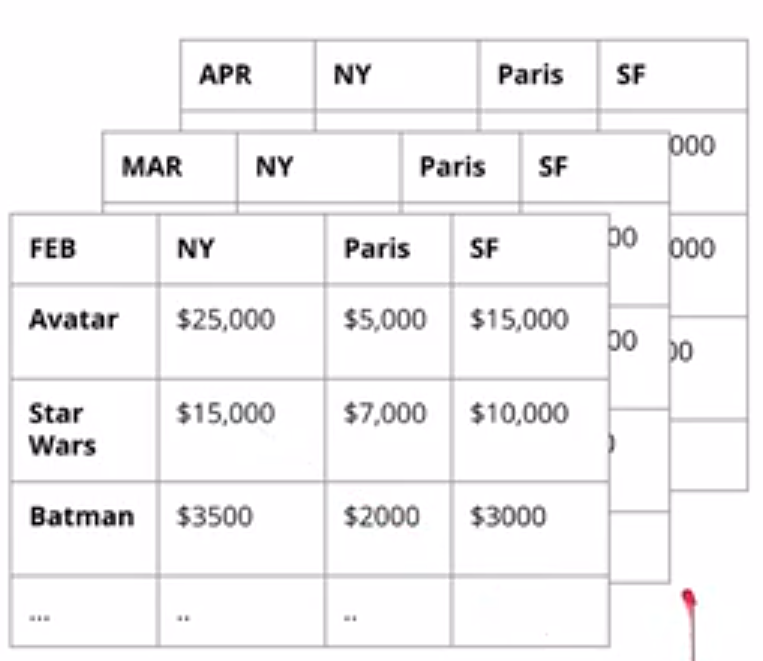

# 03-Data Warehouses
_Udacity - Data Engineering Nanodegree_

Syllabus:
1. Basics of Data Warehousing
2. Intro to Amazon Web Services
3. Building a data warehouse on AWS

## Introduction to Data Warehouses

### What is a data warehouse?
#### Business Perspective
- Customers should be able to find goods and make orders
- Staff should be able to stock and re-order goods
- Delivery staff should be able to find and deliver goods
- HR should have an overview of staff
- Management should be able to see sales growth
- etc.

---

**Operational Processes**
- e.g., find goods, make orders, deliver goods

These are typically *online transactional processing* databases (OLTP) and often 3rd normal form

**Analytical Processes**
- e.g., Assess sales staff performance, measure growth

These are typically *online analytical processing* databases (OLAP) and de-normalized

---
Except for very small databases, it's not a good idea to use the SAME data structures for analytical and operational tasks - so we will need to create different (but complementary) structures to support these different needs of the business. **This is where a data warehouse comes into play**

> **A data warehouse is a system which retrieves and consolidates data from source systems (operational processes) for the purpose of enabling analysis**

---

### Recap of dimensional modeling
Third normal form databases are optimized for consistency (rather than speed). For OLTP purposes, this is fine (or even preferable), but for OLAP purposes, we will want to use a de-normalized form, such as a fact & dimension tables.
- **Fact Tables** record business **events**, such as orders, phone calls - stuff that typically symbolizes the relationship between data
- **Dimension Tables** reocrd business **attributes** like individual stores, customers, products, and employees.

However, sometimes it's not always clear what is a *fact* and what is a *dimension*. A simple rule of thumb is **facts are usually numeric and additive**.
For example:
- a review on an article is technically an event, but we can't easily make statistics out of its text content (not a good 'fact')
- invoice numbers might be numeric, but they're not additive (not a good 'fact')
- invoice amount is both numeric and additive (would be a good fact)

Also:
- Date & time are always dimensions
- Physical locations and their attributes are good dimensions candidates
- Products are almost always dimensions

#### Moving from 3rd normal form to fact & dimension tables:
Here's an example from the Udacity course of how you could take a 3NF database and transform it into a de-normalized fact & dimension setup:



---

### Data warehousing (DWH) architecture
There have been different proposed architectures for data warehouses which have tried to optimize for different things.

#### Kimball's Bus Architecture


Kimball's Bus Architecture:
- Separates ETL and source transactions (source data) entirely from the presentation of data ("back room" vs. "front room")
- Final data always contains data on the most basic atomic level (i.e., not aggregated) although extra aggregations may also exist.
- Data should be organized according to business processes or departments (focus on end user for data organization)
- Uses "**conformed dimensions**" - across all views and tables, if any dimensions can be used in a standardized way (e.g., date), then all views and tables **use the same** dimension table.
- Design Goals:
  - Ease of use
  - Query performance

Designing a Kimball's Bus can be facilitated by making a simple table of which business units require which dimension tables. It's then possible to see the overlap in needs and therefore whether it's possible to standardize any dimension tables.

---

#### Independent Data Marts


Independent Data Marts:
- Often occurs as an ad hoc (unplanned) system
- Still has a 'front room' and a 'back room' like Kimball's bus, but **each department designs its own separate ETL processes for its own data needs**
- Has therefore no conformity between views generated by different departments; can lead to inconsistency
- This model is generally discouraged due to inefficiencies (each ETL by each department is repeating work) and inconsistency.
- This model does however reduce the overhead of coordination and centralized ETL.

---

#### Inmon's Corporate Information Factory (CIF)


Inmon's CIF:
- Starts with an ETL to create an intermediate 3NF data warehouse ("Enterprise Data Warehouse") from data acquisition structures
- From this Enterprise data warehouse, data marts are created with another ETL (but data marts are coordinated because they are pulling form same data warehouse)
- This is essentially a balance between Kimball's bus (totally centralized) and the independent data marts (totally de-centralized)
- Analysts can query all data starting with the Enterprise Data Warehouse, including the data marts
  - This gives most transparency and flexibility to analysts to choose the data format that works for them (also increases complexity)
- Data marts are mostly aggregated (no need to have de-aggregated if 3NF database also exists)

---

#### Hybrid Bus & CIF


Hybrid Bus & CIF:
 - Essentially the CIF model *except* that instead of independent data marts, it uses the shared dimension structure of Kimball's bus
---

### OLAP Cubes
OLAP cubes are **aggregations of a fact metric on a certain number of dimensions** (e.g., income by city, by brand, by month, etc.). These are essentially cross-tabs from statistics with 2 dimensions. With 3 dimensions (or more), they are represented as *series* of cross-tabs.

OLAP cubes are popular for easily communicating results to business users.



You can also perform additional analyses on OLAP cubes such as:
- **Rolling Up**
  - taking a lower-level dimension (e.g., month) and combining it into a higher-level dimension (e.g., year)
- **Drilling Down**
  - Opposite of rolling up (e.g., year -> month)
- **Slicing**
  - Taking a N-dimension OLAP cube and choosing to only look at certain values of a certain dimension (e.g., dimension == month, but let's look only at March; effectively removes a dimension)
- **Dicing**
  - For one or more dimensions of the OLAP cube, *restrict* the range of values (let's look at movie revenue for March-April and for cities L.A. and N.Y.C.; effectively makes a sub-cube)

OLAP cubes as a data structure therefore need to be able to access *the most granular* ("atomic") data, so that drilling down arbitrarily on different dimensions is possible.

---

>**IMPORTANT**
In many SQL languages, there is a built-in functionality to create OLAP cubes!
`GROUP BY CUBE(movie,city,day)`
This will make one pass through the data and aggregate all *possible* combinations of the specified dimensions.
Providing this 'cube' to business users can speed up analysis (where the alternative is providing the raw dataset for any ad hoc query)

How do we then **serve** these OLAP cubes to users?
1. We **pre-aggregate** the OLAP cubes and save them on a special-purpose non-relational database (Multi-dimensional OLAP; MOLAP)
   1. Often involves using a dedicated OLAP server to serve these data
2. Compute the OLAP cubes **on the fly** from existing relational databases where the dimensional model of data resides (ROLAP)
   1. More popular currently


#### Making accessible ROLAP cubes with columnar storage
Note: We can make ROLAP more efficient by transforming our data to create a new, columnar table extension

- Instructor is using Postgres with an extension [cstore_fdw](https://citusdata.github.io/cstore_fdw/)

```
-- Load extension 1st time after install.
CREATE EXTENSION cstore_fdw;

-- create server object
CREATE SERVER cstore_server FOREIGN DATA WRAPPER cstore_fdw;

-- create foreign table (foreign tables saved in a different format)
CREATE FOREIGN TABLE my_table
(
  customer_id TEXT,
  review_date DATE,
  review_rating INTEGER,
  review_votes INTEGER,
  product_id CHAR(10),
  product_title TEXT,
  similar_product_ids CHAR(10)[]
)

-- Changing server options (might only be necessary if we're loading data from zipped files, as the instructor did)
SERVER cstore_server OPTIONS(compression 'pglz');
```

Note: When the instructor compared the time needed to process the table above vs. the same table made in the normal postgres way, the columnar-style table above was about 27% faster.

>Question: I learned from another Postgres training that we can create different types of indexes to speed up query performance as well. Is it better to use that or move to columnar storage?
> I personally like using Postgres' native functionalities rather than depending on an open-source package which might be harder to depend on.

---

### Recommended further reading:

- [The Data Warehouse Toolkit: The Complete Guide to Dimensional Modeling (Kimball)](https://www.amazon.com/Data-Warehouse-Toolkit-Complete-Dimensional/dp/0471200247)
- [Building the Data Warehouse (Inmon)](https://www.amazon.com/Building-Data-Warehouse-W-Inmon/dp/0764599445)
- [Building a Data Warehouse: With Examples in SQL Server (Rainardi)](https://www.amazon.com/Building-Data-Warehouse-Examples-Experts/dp/1590599314)

