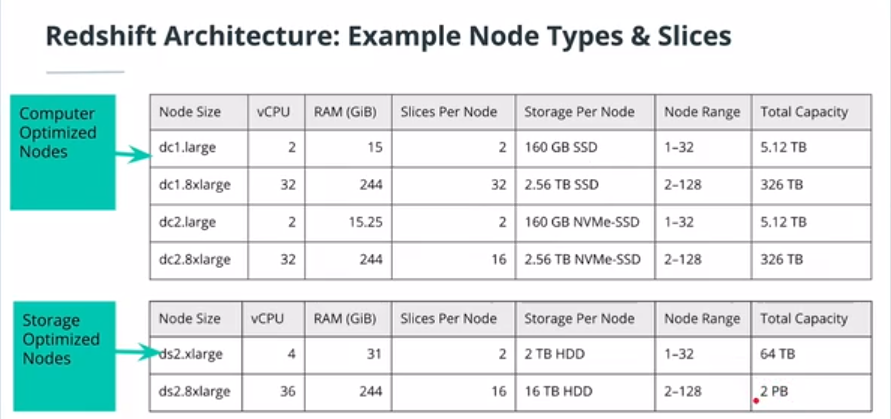
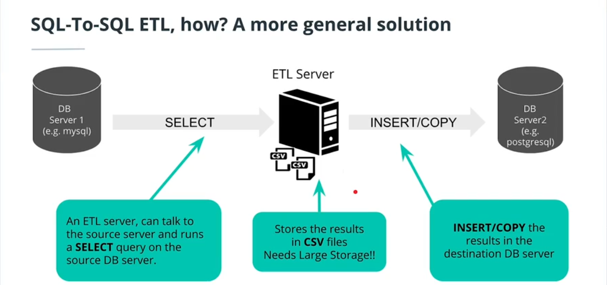
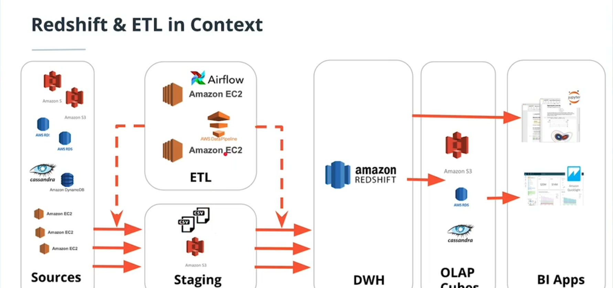
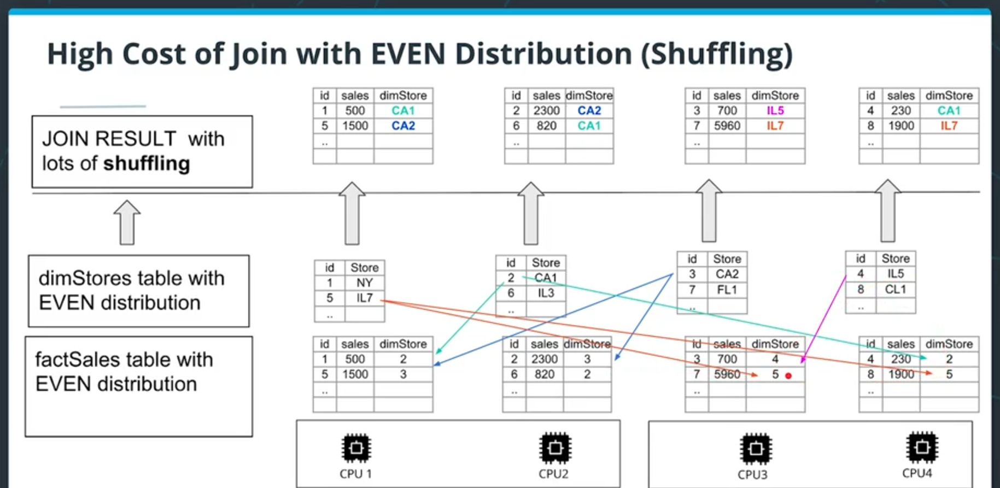
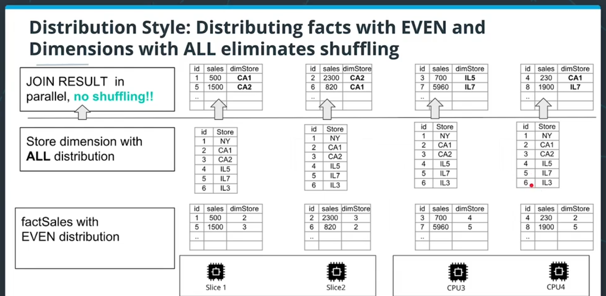
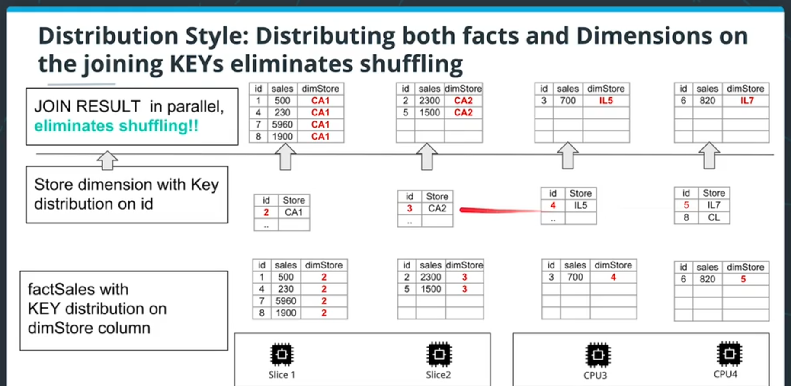

# 04-AWS_DataWarehousing
_Udacity - Data Engineering Nanodegree_

## Introduction to Cloud Computing
It's a scalable network of servers to manage and process data.

- Eliminates need to invest in hardware
- Allows scalability
- Allows remote access natively

## Introduction to AWS
- Currently (2022) offers >140 services across computing, storage, event buses, databases, permissions, etc.
- Accessible via:
  - dedicated CLI
  - Web UI console
  - Software development kits (SDKs)
    - **Note: SDKs provide tools, libraries, documentation, examples, etc. to form the basis of new application development**

Note: The "AWS Toolkit" in VS code is an SDK to connect and interact with AWS services.
  
### AWS Costs
- Leaving services running on AWS (even unused ones) incurs costs. **Be careful about turning AWS services off - don't leave AWS without doing this.**

## Implementing a data warehouse on AWS
Includes:
- ETL
- Storage
- Table Design
- Query optimisation

### Data warehouses on AWS - why?

>Review of Data Warehouses
Generally speaking, data sources are heterogenous. Sales tracks data differently from logistics, tracks data differently from product.
From these data sources, an ETL pipeline transforms data into a dimensional OLAP store which can then feed analytics.

Cloud-based services are often more popular than on-premise data warehouses because cloud services allow both the easy growing-and-shrinking of resources needed.

>Note: Within AWS, we can choose to either (a) use Amazon's existing services (e.g., Redshift, Kinesis, SQS, S3, etc.) OR (b) to simply spin up an EC2 instance (virtual machines) and build whatever we want from scratch.
In the example of a database, we could choose to implement Postgres on Amazon RDS, or we could create an EC2 instance and install Postgres ourselves.
The advantage to using Amazon's services is that they often do a lot of the work of security and configuration for you. An EC2 option is a 'catch all' that is maximally configurable.


So, in summary: AWS lets us scale as we need to - and offers managed solutions like Redshift or RDS to let us start building a database without worrying about setting up the infrastructure from scratch.

---

### Amazon Redshift Architecture
Amazon Redshift has column-oriented storage (rather than row-oriented) that excels at processing huge amounts of data for complex queries (OLAP optimized).

>Redshift is actually Postgres under the hood with some modifications for custom columnar storage.

Most relational databases can only run queries on a single CPU at a time. This is typically fine for OLTP processes, since queries are usually simple and a RDBMS can still schedule separate queries on separate cores. For OLAP processes, however, queries can sometimes be complex, so spreading the query out over multiple cores is very useful.

Redshift and other massively-parallel processing (MPP) databases can utilize multiple cores for single-query processing by partitioning the table to be analyzed over separate cores.

>Note: I think this is similar to how Apache Spark works - partitioning queries over multiple worker nodes.

When using Redshift, you also choose what type of **nodes** that you want to use. These range in terms of power (CPU, memory) and storage - with some nodes favoring storage over power and vice-versa:



---

### General ETL concepts
1. For very basic database transformations, we could do something like the following, which is basically just creating a new table on the same database.
```
SELECT fact1, fact2
INTO newFactTable
FROM oldTable
WHERE oldTable.id <> null
GROUP BY oldTable.date
```
However, this only works for transformations which (a) want the result on the SAME database (unlikely) and (b) which don't require substantial transformation of the data between the old and new tables.

The code above **is** an ETL - just a very basic one. And we can think of ETLs basically like APIs, with an additional 'transformation' piece within (i.e., we are trying to get 2 different databases, possibly running different RDBMS to talk to each other).

So the issue with getting RDBMS to talk to each other is that (a) most SQL dialects don't always support data migration functions, (b) if we bind ETL functions to storage, then it can be more difficult to centralize and coordinate ETL activities (e.g., if we have ~10 data sources and they're all pushing data to a central database)

So a solution to this is an 'ETL-in-the-middle'- where we have a dedicated ETL system existing between 2 databases that is optimized for read-write operations and data transformation work and which can speak the languages of the source and the destination.
In the image below, for example, a central ETL server has both mySQL and Postgresql clients so that it can read data from mySQL, store as CSVs, and then insert these records into Postgresql.



AWS is interesting as a cloud computing provider because it not only provides standalone services such as Redshift or S3, but it ALSO provides coordination and scheduling of the interactions of those resources. For example, we can schedule a RDS instance in AWS to push all of its files to an S3 bucket. Then, we can schedule our Redshift instance to pull any and all files from that bucket as they come in. So in this way, AWS can actually supply most or all of the extract and load functionalities of an ETL.
However, if you did need something more complex, you could always spin up an EC2 instance to run a custom ETL.



Note: In the image above, there are 2 ways illustrated to load the BI apps - directly from Redshift (large at-once aggregation, could be slow) or from pre-loaded OLAP cubes stored somewhere in an RDBMS (or in memory) for more storage costs but faster reaction times.

---

### ETL for Redshift
To transfer data from an S3 storage to Redshift, we could use the `COPY` command (note that looping with `INSERT` would also work, but would be extremely slow; COPY can work in bulk).

If the file to be copied is quite large, you would want to break it into multiple files, which allows **the files to be processed in parallel**.
Ingesting in parallel happens by default if:
- The files have a common prefix or
- You have manifest file naming the files which go together

Other tricks:
1. It's a good idea to *compress* data files before putting them in S3 / ingesting them to S3 (Redshift can decompress)
2. Better to make sure all of your files are in the same AWS region (having files across multiple regions can slow things down)

Example of using **prefix** to copy multiple files (run from Redshift):
```
COPY ticket_data FROM 's3://udacity-labs/tickets/split/my_file_prefix'
CREDENTIALS 'aws_iam_role=arn:aws:iam::4642342423:role/dwhRole'
gzip DELIMITER ';' REGION 'us-east-1';
```

Example of using a **manifest file** to copy multiple files (run from Redshift):
```
--Manifest file--
{
  "entries":[
    {"url":"s3://udacity-labs/tickets/split/my_file_prefix-000001.gz", "mandatory":true},
    {"url":"s3://udacity-labs/tickets/split/my_file_prefix-000002.gz", "mandatory":true},
    {"url":"s3://udacity-labs/tickets/split/my_file_prefix-000003.gz", "mandatory":true},
    {"url":"s3://udacity-labs/tickets/split/my_file_prefix-000004.gz", "mandatory":true},
  ]
}
COPY ticket_data FROM 's3://udacity-labs/tickets/split/my_file_prefix'
CREDENTIALS 'aws_iam_role=arn:aws:iam::4642342423:role/dwhRole'
gzip DELIMITER ';' REGION 'us-east-1';
```

**Note on data compression for Redshift**
The optimal compression strategy **differs by data type**. Redshift gives the user control over the compression for each column, but the `COPY` command makes best-effort compression decisions in the absence of user input (and provides output logs to show what compression was done).
- Question: When exactly does Redshift do this compression? In the COPY  commands used above, the files were already compressed (.gz)


**Note on using EC2 instead of S3 for ETL to Redshift:**
As noted above, we can set up a basic extract-load pipeline simply using S3 as a staging area and taking advantage of AWS infrastructure (which allows these services to talk to each other, schedule jobs without additional user-defined code).
However, if you need more flexibility (and don't mind additional set-up and maintenance), it is also completely possible to build the ETL on an **EC2 machine** (and use this machine to do additional needed *transformation*). In this case, you could potentially also use S3 as a temporary storage area that the EC2 instance would draw on (or potentially also use storage that EC2 has - not sure how big this is).

- It seems that we can *at least* use RedShift to **pull** data from an EC2 instance ([more info here](https://docs.aws.amazon.com/redshift/latest/dg/copy-parameters-data-source-ssh.html))
  - is it possible to also just **push** to Redshift from the EC2? That seems more useful if we do transformation and immediately want to offload data to Redshift?

**Getting Data out of Redshift to BI app**
Option 1: The BI app queries Redshift directly using standard "Open Database Connection" (ODBC) API or "Java Database Connection (JDBC) API
Option 2: We load aggregated data (e.g., as OLAP cubes) into another (more easily accessible?) RDBMS / other storage.

Note that option #2, when done from Redshift to S3 for example, looks something like this:
```
UNLOAD (SELECT * from my_table)
to "s3://mybucket/olapFolder"
iam_role "arn:aws:iam:9728942234:role/myRedshiftRole;
```

---

### Setting up Amazon Services using Infrastructure-As-Code (IAC)
IAC allows us to write definition files which can be interpreted as instructions for setting up environments & resources.
AWS allows us to write this code and deploy it using:
- Command-line interface
  - This involves creating BASH scripts to give commands to the AWS CLI
- AWS Software development kit (SDK)
  - This allows us to write code in Python, Java, Node, C++, etc. as a way to design and deploy AWS infrastructure.
  - **Note: The Python AWS SDK is called boto3!**
- Amazon Cloud Formation
  - JSON (or Yaml?) description of objects and permissions
  - This can be a nice feature because this only works if everything in the definition file is valid (prevents us from deploying some resources but not others)
  - This is essentially AWS-managed IAC

---

### Building a Redshift cluster
To start building our Redshift cluster for *testing purposes*:
1. Head to Redshift service and select "Quick Launch Cluster"
2. Node type should be `dc2.large` (cheapest type)
3. Set up **4** nodes
4. Name cluster identifier as you like
5. Name database name as you like
6. Keep port as `5439` (default)
7. Enter credentials to confirm.
8. Click 'Launch cluster'
9. Once cluster is created, click 'Query Editor' to see the SQL editor

### Optimizing Redshift table design
Redshift tables are partitioned to optimize query performance. However, as opposed to Cassandra, Redshift does this **randomly** unless you specify how to partition.
Redshift offers two ways to partition:
- Distribution Style
- Sorting key

---

#### Distribution Style
**EVEN Distribution**
- Splits table evenly across as many CPUs as are available to the cluster- like dealing cards in a card game as more rows are inserted.
- Works well if there will be NO JOINS- because with JOINs you might have to look up part of a table which lives on another CPU- which can be very resource-intensive.



**ALL Distribution (a.k.a. "Broadcasting")**
- Not doing any partitioning for some small tables- but copying the small tables across all CPUs to speed up joins.
  - Can work well for small dimension tables (Where fact tables are still partitioned across CPUs)
  - Wastes some space, since small tables are replicated completely.



**AUTO Distribution**
- Redshift gives you the option to let AWS make the decision whether to do 'ALL' or 'EVEN' strategies for the tables you upload.

**KEY Distribution**
- Key distribution is similar to the partitioning key on Cassandra- you define which column you want to partition on and then data is partitioned according to unique values in that column.
- This can lead to data being skewed to be larger on some CPUs than others
- This can be a good strategy when some dimension tables are too big to be distributed with ALL distribution - you can store fact and dimension table together according to the same foreign key- so that there is never any cross-CPU lookups.



```
CREATE TABLE myTable (
  lo_orderkey integer not null,
  lo_partkey integer not null distkey,
  lo_suppkey integer not null
);
```

---

#### Sorting Key
When defining tables, we can choose one column to be a *sorting key* (much like clustering key in Cassandra).
Upon loading data, rows are sorted according to the key before being partitioned (a.k.a. sliced).

This is especially helpful if you want to ORDER BY or GROUP BY a specific column
