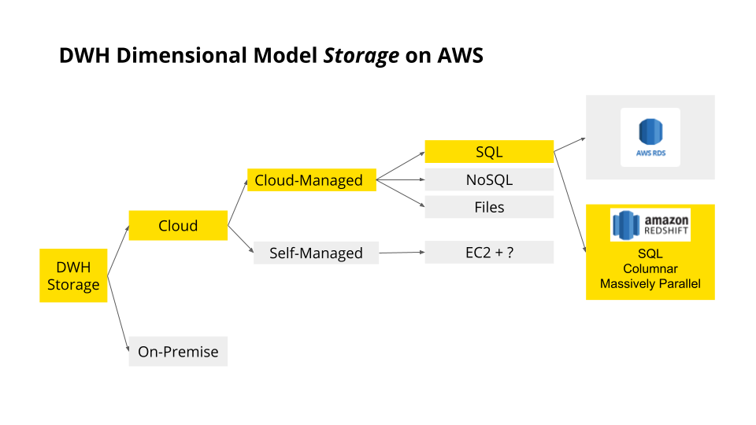

# 04-AWS_DataWarehousing
_Udacity - Data Engineering Nanodegree_

## Introduction to Cloud Computing
It's a scalable network of servers to manage and process data.

- Eliminates need to invest in hardware
- Allows scalability
- Allows remote access natively

## Introduction to AWS
- Currently (2022) offers >140 services across computing, storage, event buses, databases, permissions, etc.
- Accessible via:
  - dedicated CLI
  - Web UI console
  - Software development kits (SDKs)
    - **Note: SDKs provide tools, libraries, documentation, examples, etc. to form the basis of new application development**

Note: The "AWS Toolkit" in VS code is an SDK to connect and interact with AWS services.
  
### AWS Costs
- Leaving services running on AWS (even unused ones) incurs costs. **Be careful about turning AWS services off - don't leave AWS without doing this.**

## Implementing a data warehouse on AWS
Includes:
- ETL
- Storage
- Table Design
- Query optimisation

### Data warehouses on AWS - why?

>Review of Data Warehouses
Generally speaking, data sources are heterogenous. Sales tracks data differently from logistics, tracks data differently from product.
From these data sources, an ETL pipeline transforms data into a dimensional OLAP store which can then feed analytics.

Cloud-based services are often more popular than on-premise data warehouses because cloud services allow both the easy growing-and-shrinking of resources needed.

>Note: Within AWS, we can choose to either (a) use Amazon's existing services (e.g., Redshift, Kinesis, SQS, S3, etc.) OR (b) to simply spin up an EC2 instance (virtual machines) and build whatever we want from scratch.
In the example of a database, we could choose to implement Postgres on Amazon RDS, or we could create an EC2 instance and install Postgres ourselves.
The advantage to using Amazon's services is that they often do a lot of the work of security and configuration for you. An EC2 option is a 'catch all' that is maximally configurable.

So, in summary: AWS lets us scale as we need to - and offers managed solutions like Redshift or RDS to let us start building a database without worrying about setting up the infrastructure from scratch.

---

### Amazon Redshift Architecture
Amazon Redshift has column-oriented storage (rather than row-oriented) that excels at processing huge amounts of data for complex queries (OLAP optimized).

>Redshift is actually Postgres under the hood with some modifications for custom columnar storage.

Most relational databases can only run queries on a single CPU at a time. This is typically fine for OLTP processes, since queries are usually simple and a RDBMS can still schedule separate queries on separate cores. For OLAP processes, however, queries can sometimes be complex, so spreading the query out over multiple cores is very useful.

Redshift and other massively-parallel processing (MPP) databases can utilize multiple cores for single-query processing by partitioning the table to be analyzed over separate cores.

>Note: I think this is similar to how Apache Spark works - partitioning queries over multiple worker nodes.

---

### General ETL concepts

### ETL for Redshift

### Building a Redshift cluster - Part 1 - Logistics

### Building a Redshift cluster - Part 2 - Infrastructure as Code

### Optimizing Redshift table design

