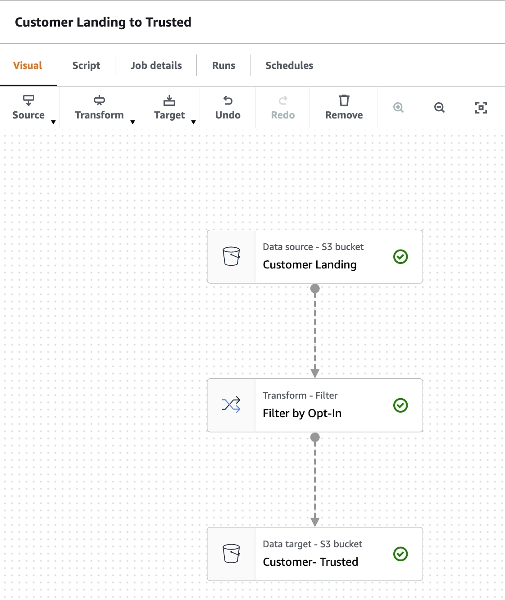

# Notes on using AWS Glue

## Glue APIs
Glue APIs give access to resources like **Glue Tables** and **Glue Context** (TODO: Fill in what these actually do).

---

## Notes on AWS Cloudshell
AWS Cloudshell is a built-in bash shell that you can access from the web UI upon logging in to AWS.
The AWS Cloudshell has built-in persistent file storage. So, it's actually possible to put files on there and then move them around the AWS environment (e.g., move them to S3). This is probably best for testing purposes only, but still cool.
Note that there **IS** a charge for the files stored in this Cloudshell directory, so once you're done, you can delete the Cloudshell directory using the "Actions" tab in the Cloudshell..

As a side note to this side note, the AWS Cloudshell actually runs on a virtual machine, so if you haven't used it in awhile, it might need to spin up again!

---

## Glue Studio
Glue Studio is a GUI for interacting with Glue to create Spark jobs with *added capabilites*.

Glue Studio also offers a drag-and-drop method of coding as well - along with some pre-defined common methods to apply to the data *and* preconfigured connections to common AWS data sources and sinks.

**Built-in transformation types:**
- Apply Mapping
- Select Fields
- Drop Fields
- Drop Null Fields
- Drop Duplicates
- Rename Field
- Spigot
- Join
- Split Fields
- Select from Collection
- Filter
- Union
- Aggregate
- Fill Missing Values
- **Custom Transform**
- **Custom SQL**
- Detect PII
- etc...

**Built-in data source/sinks:**
- S3
- Glue Table
- Dynamo
- Redshift
- MySQL
- PostgreSQL
- Microsoft SQL Server
- Oracle SQL
- etc...

## Glue Data Catalog
The glue data catalog is a store of connection information. By default, it connects to AWS resoruces (Redshift, Kinesis, S3), but we can also configure it to include things like Kakfa and external databases.

## Glue tables
Glue tables are definitions of specific groups of fields that represent logical entities. The Glue Catalog is made up of multiple table definitions.
**Note that these tables are not physically stored in Glue. Glue tables are just a metadata catalog layer.** They store a reference to data that we can query or store.

It's convenient to make sure that your Glue Catalog is up-to-date, since this will make using Glue easier. There are a few ways to add to your Glue Catalog:
- Run a Glue Crawler over a data store. This determines the data structures in the data store and writes tables into the Glue Catalog. You can run your crawler on a custom schedule and also define built-in classifiers to help it determine the structure of certain data sets.
- Use the AWS Glue Console to manually create a Glue table
- Use SQL to define a table with DDL (data defintion language) or `CREATE` statements.
- Use the `Create Table` operation in the AWS Glue API
- Use Cloudformation resources

> **Example of Glue Tables:** Let's say we have a set of files placed in S3 by an external source. We want to determine how many records are in all of the files.
> We can do this by creating a Glue table definition and using SQL.
> 1. Find the **Glue Data Catalog** in the AWS services list
> 2. Click 'Add database' from the GUI
> 3. Enter the name of your database (as you want it represented in Grepresentedlue)
> 4. Select 'Create Tables' from the side menu
> 5. Select 'Add table manually'
> 6. Enter the name of the table you are defining (as you want it represented in Glue) and the database its part of from step #3
> 7. Add the configuration of where to find the data (type and path)
> 8. Choose the data format (e.g., JSON, CSV, parquet, etc.)
> 9. Provide the schema (note: can't Glue do this itself?)
> 10. Partition the table by a specific key
> 11. Click 'finish'

## Using AWS Athena on Glue tables
Once you've set up a Glue table, you can query it using Amazon Athena.

> **NOTE:** You don't need a Glue data table to query S3 data from Athena - Athena also offers the option to connect directly to S3. The ability for Athena to use Glue is just a convenience (e.g., if we set up an ETL in Glue, we could use Athena to query the data in our bronze, silver and gold tables pretty easily).

To configure Athena, you'll need to follow these steps:
1. Tell Athena where to store the query results
2. Encrypt results (if desired)
3. Using the query editor, type in your query. You can use the Glue table name.

**NOTE:** From the Athena table interface, you can also generate DDL to show the schema of the table and thereby create this schema elsewhere. Convenient!

---

### Personal Notes about Glue Studio
When should I use Glue Studio? It feels a bit weird to relinquish the details to the program. At the same time, I can't deny that having a visual representation of the data pipeline DAG is pretty nice for (a) understanding the pipeline and (b) actually editing it:

I actually see no compelling reason **NOT** to use Glue for building my data pipelines:
- It has full integration with AWS resources
- It has built-in transformation code which is probably great for >90% of use cases (and I can build in performance tests to see if any of these are poorly optimized and build my own versions of the transformations if needed)
- It allows myself and others to see the DAG more clearly and debug/edit it than if we were using code alone
- Since I don't have to write the connections and transformations myself, it will probably speed up development a lot.

**Conclusion:**
Embrace the Glue.

---

## Tutorial: Setting up a pipeline on AWS Glue

### Setting up a Spark Job with Glue Studio
1. Open up AWS Glue Studio from the web interface
2. Select 'Jobs' from the side menu
3. Create a "Visual with a source and target" job. Specify that "S3" is the source and "S3" is also the target.
   1. For both the source and the target, you will need to specify the S3 location to read/write from/to.
   2. It's also good practice to name the source and target nodes (e.g., "source data" and "cleaned_data")
   3. Click 'infer schema' from the source node to auto-generate a schema of the stored data. **You can use this in downstream nodes.**

### Setting up a "filter" transformation
Back in the visual editor, add a 'Transformation' node between the source and target nodes of the type 'Filter'.
You can now use the GUI to select how you want to filter (e.g., "firstName" + "!=" + "Kevin").

### Finishing the job
1. Head to 'Job Details'
2. Name the job and select the appropriate role
   1. (see `./Glue_boto3Setup.ipynb` file in this directory for details on the role and policies used for this).
3.  If you're learning, consider *disabling* the job bookmark (this prevents the re-processing of data you've already processed).
4. Click the 'Run' button

### Viewing logs & debugging
1. Click on 'Runs' in the top menu
2. From here you can see any current job runs.
3. Click the 'id' link to see more run details. In this screen scroll down to find cloudwatch logs. Choose 'Error logs'
4. Review the log streams to find more details of the job(s). Note that since we're running Spark, we will have multiple logs (from each machine) for each run.

### Generate the script
1. If you so choose, you *can* generate a script based on the DAG you created in the GUI. The caveat is that *it's written with Glue - so it's only runnable on AWS Glue...*
2. This is however, still useful for version control.