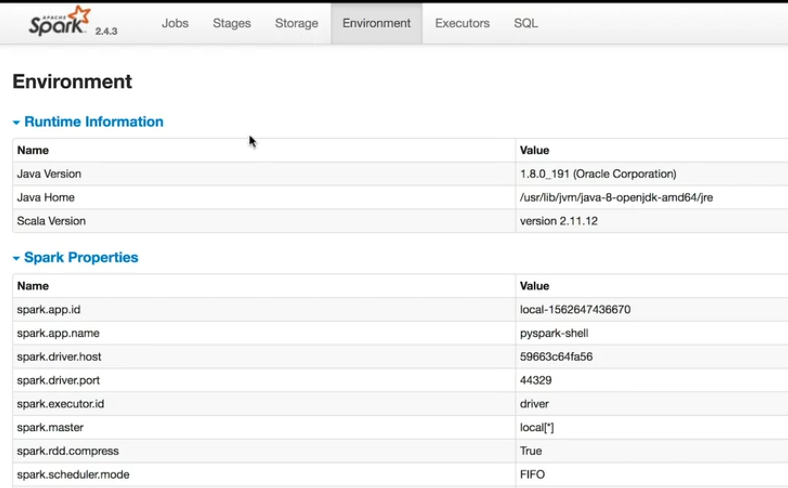
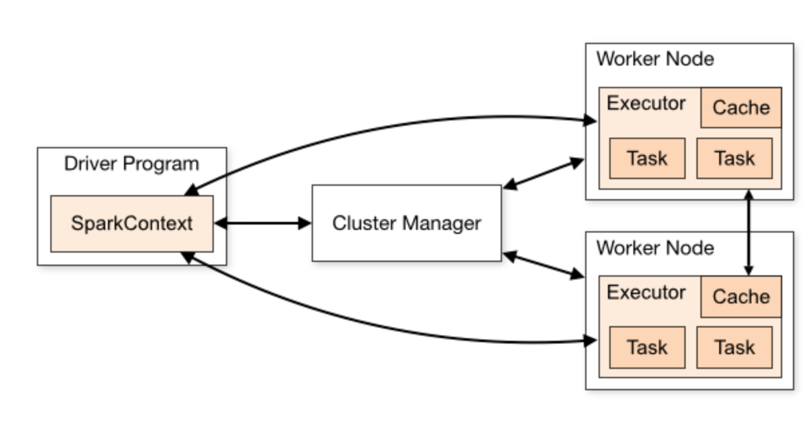

# Debugging Spark
_Udacity - Data Engineering Nanodegree_

## Why debugging Spark is hard
1. Spark is running on a set of other machines - that might be configured differently than your computer. Even if your code runs in local mode, it might fail in the different environment.
2. You don't have direct access to the Spark logs on each machine in the cluster. Instead, they are all captured on a single that you must then get the logs from.
3. Spark uses **lazy evaluation** - meaning that a mistake made previously in the code might not throw an error until a later step.
4. Spark is written in Scala, so errors might refer to Scala, Java or JVM issues even though code might be written in Python.

## Some common Spark bugs
- Typos in method names (produce short 'attribute error's)
- Typos in column names for a data frame (produce long 'analysis exception error's)
- Using `collect()` with too much data
- Mismatched parentheses & typos in variables (the usual suspects)
- using Python aggregate functions (e.g., "sum") instead of the Spark equivalent (also called "sum" - needs to be given an alias)

## Spark Accumulators as debugging help
"Accumulators are like global variables for your entire cluster".

Since Spark is running in a distributed manner, we can't introduce any state dependencies between worker nodes that we might use for debugging, but we *can* ask our worker nodes to append data to an accumulator.

> EXAMPLE:
> Let's say we are cleaning our data set and we want to count how many rows have an incorrect value for a certain column and print out that number. With a small(ish) data set, we could simply do this in one command in a Jupyter notebook, but that won't work for big data.
> Instead, in this case, we can use an accumulator to count how many rows are found by each worker node and sum the result:

```
#Defining an accumulator
records_count = SparkContext.accumulator(0,0)

#Function to increment accumulator
def increment_records_count():
    global records_count
    records_count += 1

#Function to find rows matching criteria and increment counter:
from pyspark.sql.functions import udf
check_record = udf(lambda x: increment_records_count() if x == "Attack Helicopter" else 1)

#Add column showing result:
df = df.withColumn(good_record,check_record(df.gender))

#Force Spark to run:
df.collect()

#Check result:
records_count.value
```

**NOTE:** As with all global variables, accumulators are vulnerable to errors when their values are not reset, but code is repeated for some reason.

**NOTE:** I like the idea much more of creating an output data frame which analyses all of my columns and provides some statistics (e.g., how many values in a specified column matched user-given criteria? How many missing values per column?). Then I could take that output data frame and get lots of answers instead of setting up lots of accumulators.


[Spark documentation on Accumulators](https://spark.apache.org/docs/2.2.0/rdd-programming-guide.html#accumulators)

---

## Spark Broadcast
Spark Broadcast is a way for the master Spark node to distribute read-only packets of data to all worker nodes.

This is an attempt to reduce simultaneous network traffic: normally worker nodes receive tasks and data attached together, which can be network-heavy. By sending Spark broadcasts at a later time, data can be sent after tasks, reducing network load.

```
#Code for Spark broadcast

sc = SparkContext('local[*]','pyspark')

my_list = [1,2,3,4]
my_list_rdd = sc.parallelize(my_list)

result = my_list_rdd.map(lambda x: x).collect()
print(result)

>> [1,2,3,4]
```

---

## Types of Spark functions: Action and Transformation
Spark functions are either **transformations** (aggregating,filtering,sorting, etc.) or **actions** (write, collect, show, etc.). Spark is not triggered to actually make edits until action functions are called.

We can of course take advantage of this - since we know Spark is not performing anything until action functions, we can be strategic about when they are called in our code.

However, it's also good to be cautious - if we defer all of our processing until the last step, it might take a long time and disguise bugs we made earlier.

---

## The Spark Web UI
To help debug, you can use Spark's web UI - which allows you insight on the DAG of the Spark jobs you're running (including the various stages and stage tasks of the DAG) and an overview of the cluster and its nodes.

Connecting to remote computers can often be done in different ways for different purposes - for example using SSH (typically via port 22) to securely transfer files, but using unprotected HTTP (typically via port 80) simply for viewing statistics on the cluster.

Spark offers pre-set ports for interacting with a user:
- **7077** - used by the master node to communicate with worker nodes.
- **8888** - used to connect to Jupyter notebooks
- **4040** - shows active Spark jobs
- **8080** - web UI for master Spark node
  - This is the port you will probably use the most


### Walkthrough of Web UI



You can access the master nodes' web UI via the node's IP address on port 4040 (in local mode apparently you can use 'Docker host').
- Note: I don't really understand how Docker is involved here. Are we running Spark on Docker?

**Environment**
Shows configuration parameters of the application, version, etc.

**Executors**
Seems to show details about the executors which operate inside the worker nodes (e.g., how many tasks they have run successfully).

It's in the executors section where we can find logs for each of the executors - and further troubleshoot the code as needed.
>To change how logs are kept, you can use the Spark Context of your Spark application:

```
#This will restrict logs to ONLY errors - we won't see any other logs:
sc.setLogLevel("ERROR")

#This will enable even more verbose logging:
sc.setLogLevel("INFO")
```



**Storage**
If you have cached RDDs in the application, you can find them here (not sure what this really means)

**Jobs**
A Spark application consists of as many jobs as we have action functions in the code. Spark jobs consist of smaller 'stages' - units of work that depend on one another and which can be further parallelized.

Within each stage, we have 'tasks' - a smaller unit of processing. Tasks are a series of Spark transformations that can be run in parallel on different partitions of a data set.

Jobs offer duration metrics so that users can troubleshoot particularly slow parts of the application


[More information on Spark Web UI](https://spark.apache.org/docs/latest/monitoring.html)

---

## Spark Code Optimization
Particularly when working with big data, it's vital that your code can scale. There are a few ways to improve this:

---

#### Partition data evenly
Like when working with Cassandra or Redshift, if you partition data across Spark workers *unevenly*, your Spark job won't work as well (called "Data Skew", but doesn't refer to data distribution like it does in stats).

>Pareto Principle: when 80% of your data comes from 20% of your users.

>Note: This is extremely similar to statistics. It's a very good idea to run some descriptive statistics of your dataset to understand the overall distribution of different variables. Or, if that's not possible, *randomly* sampling a certain percentage of your data to understand possible issues. Then, consider making some tests to ensure your code can pass the tests before running on the cluster (e.g., can I distribute data evenly consistently?).

>Note: What if I wrote a short function to do the following:
1. Iteratively analyze each column, getting counts of unique values
   1. Maybe abandon if # of unique values greater than 500 or something
2. Get range from highest to lowest count for unique values for each column
3. Divide range by total # of records analyzed to get index showing skew (lower is better)

**Solutions:**
- Partition your data by a variable which has less skew
  - Can also create a fake variable that's evenly distributed to partition on.
  - For example, instead of partitioning by year or month, which might be skewed, we could try to partition by year-month (concatenated values as new column)
- Manually repartition based on number of workers
  - For example, if you have 8 workers you could run `df.repartition(8)`

---

#### Reduce your data set early
Big data is big - but maybe you don't actually need ALL of that data. Ask these questions:
- Do I need all of these columns or are some columns unnecessary?
- Can I do any filtering early in my application to limit processing?
  - e.g., cleaning data of rows we don't want to analyse / corrupt rows / empty rows / etc.

---

#### Perform aggregations and joins late
Aggregations and joins require data re-shuffling (i.e., moving data between nodes). This is the slowest part of any processing, since the network is the slowest part of a computer cluster.
If you perform these actions later (particularly after filtering / reducing your data set) you can re-shuffle less data.

---

#### More resources:
- [Spark General Tuning](https://spark.apache.org/docs/latest/tuning.html)
- [Spark SQL Performance Tuning](https://spark.apache.org/docs/latest/sql-performance-tuning.html)

---