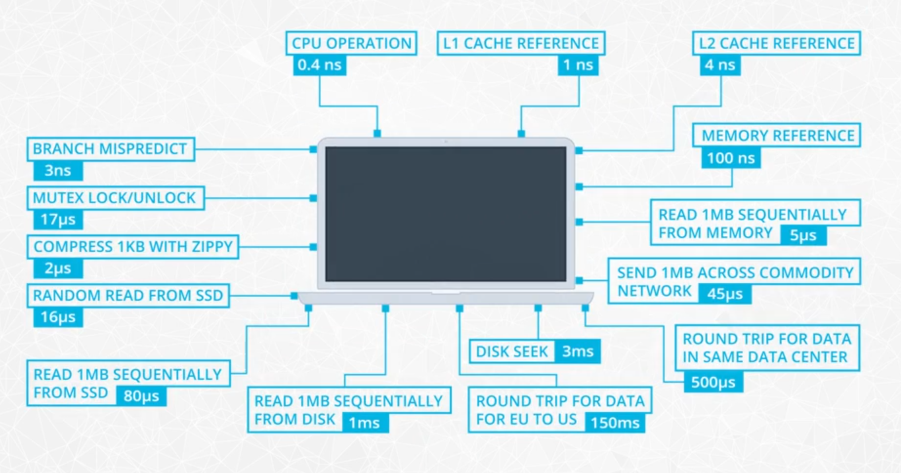

# 05-Spark & Data Lakes
_Udacity - Data Engineering Nanodegree_

## What is Big Data?
- No single definition, but a rule of thumb: big data is not possible to process on a single machine

---

## Review of Hardware behind Big Data
There are a lot of performance indicators that can be measured on a computer. Below show some indicators for a typical commercial computer around 2020:

Four of the most basic - and important - ones are:
- CPU operation (time to complete task)
- Memory Reference (time to read / write to CPU)
- Storage (time to read / write to memory or CPU)
- Network (time to send / receive a message to another computer)

>The CPU is **200x faster** than memory

>Memory is **15x / 200x faster** than SSDs / HDDs

>SSDs are **20x faster** than the network

**Question:** These numbers are suggesting that actually a *centralized* system would be most performant - if we can keep most of our data in memory and outside of storage and especially a network, we'll have faster processing. How then do we decide to use a distributed system instead? By optimizing the network somehow?

---

## Introduction to Distributed Systems
One reason that distributed systems have become so popular is because:
- They can be cheaper to build than a centralized system
  - If we compare a distributed system to a single machine, even if we kitted out that single machine with dense RAM sticks and many cores, that could become much more expensive to build custom than simply linking together regular computers and distributing the tasks across them
- They can be more scalable
  - If you limit yourself to a single machine, you will reach a point where it is no longer possible to scale the machine any more. However, a distributed system can scale virtually limitlessly, as long as the network can keep up.

Speaking of network, the instructor noted that while CPU speed, memory density, and storage capacity have all doubled every few years, the speed of the network has lagged behind - and is still quite slow when compared to these other processes.

However, there are some ways that distributed computing systems (like Spark) try to avoid excess network traffic, including:
- Limiting **Shuffling** - moving data back-and-forth in between distributed nodes of a cluster (e.g., like when Redshift doesn't have all of its data for a query within a single node)

---

## When to use centralized vs. distributed system

Using the example of Sparkify music database: let's imagine that Sparkify is brand new - and we only have ~4GB of log data to analyze.

In this case, it's relatively easy to put all of that data in the RAM of your machine and run your Python script to analyze it.
In contrast, you could instead split that 4GB data and send it out to 6 other machines to process, but **this will take longer in the end**. Your computer as-is has the power to handle this data. By distributing the processing, you include the network, which will slow things down a ton. Additionally, including other machines has the problem of making sure they're all set up correctly, not crashing, available, etc.

Now, what happens when a year or so later we have *200GB* of data to process?
Well, your computer will go *really slowly* or it will crash.
This is where we need to get more strategic about how we process this data. A few options:
- We chunk the data into smaller pieces and process them sequentially
  - e.g., if we are working with a sorted data set, we could split the file in 2 (or more) parts such that we could perform operations on each part separately and then simply concatenate them in the end (e.g., if summing up counts of a certain value)
- We process in a distributed way - sending out small bits of work to other machines
- We find a way to cut out irrelevant data from the file *before* processing (e.g., parquet files allow you to only grab certain columns of data)

The moral of the story is that **distributed processing makes sense once your computer alone can no longer comfortably process the data itself.**

---

## Parallel Computing vs. Distributed Computing
Distributed computing and parallel computing are very similar in that we are pooling resources to handle a certain task.

However, in **distributed computing**, each 'node' has its own private CPU(s) and memory. All communication happens over a network *between* nodes.

In contrast, **parallel computing**, CPUs share resources (usually the same memory), which makes communication between CPUs very fast. It's more a way of distributing work *within* a machine rather than outsourcing the work.

- Note: there is a LOT of literature on frameworks (like [OpenCL](https://leonardoaraujosantos.gitbook.io/opencl/performance)) which allow you to parallelize processing on a machine. Might be worth looking into more.
---

## History of Spark

---

## Common Spark Use Cases

---

## Other Tech in Big Data Ecosystem
