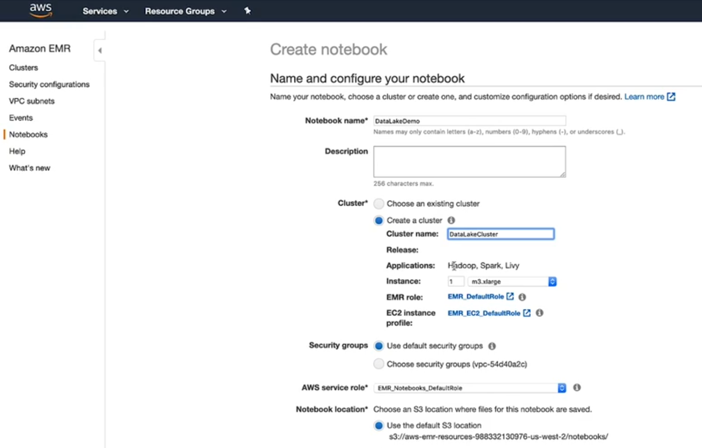

# 06- Data Lakes
_Udacity - Data Engineering Nanodegree_

## Data Lakes - Why?
Data Lakes were born initially of data warehousing technology (and instructor notes that data warehouses are still the best solution for many organizations today).

However, data warehouses are not always the most adept at specific problems that occur more often nowadays including:
- abundance of non-tabular data (images, xml, json, voice, PDF, etc.)
  - While it is possible to put JSON or XML into some kind of tabular format, we might not want to depending on how that data is eventually used. Additionally, deep JSON or XML structures would be increasingly hard to store in a tabular way.
- huge increase in data volume (resulting from IoT, etc.)
- rise of big data technologies like HDFS & Spark
  - HDFS made it possible to store petabytes of data on commodity hardware, incurring much less cost per TB vs. typical databases.
  - MapReduce, Pig, Hive, Impala, Spark, etc. made it possible to process data at scale alongside storage of the data.
  - Additionally, these tools made it possible to analyse data dynamically without needing to first create traditional tables (e.g., read.csv + create df + analyse data)
- new types of data analysis, like ML, that sometimes require more flexible formats of data (e.g., Natural Language Processing)

---

## Impacts of Big Data on infrastructure:
- Once big data infrastructure (e.g., Spark, HDFS) started to become more popular, **ETL offloading** became a advantageous choice.
>ETL Offloading: Using the same hardware for storage AND processing (i.e., nodes of a computer cluster)
- Decreasing costs for storage of data allowed for storage of more low-value or unknown-value data not previously available for analytics.
  - e.g., Data Lakes do not always require the explicit structuring of data, so including plain-text or unusually-formatted data became easy to do without significant investment.
>Schema on Read: When the schema of a file is either inferred or specified, but the data is NOT inserted into a database. Regardless, these data can still be represented tabularly and queried as if they were part of a database.

**Note:** With Schema on Read, we can easily pull in data files and query them. However, the *inferred* schema is not always correct (e.g., assuming date is a string rather than timestamp). For production or long-term data structures, you should specify the schema:
```
df_schema = StructType([
  StructField("id",IntegerType()),
  StructField("cost", DoubleType()),
  StructField("date", DateType())
])

df = spark.read.csv("myFile.csv",
  schema = df_schema,
  sep=";",
  mode="DROPMALFORMED"
)

#Registering my df as a table so I can run SQL on it:
df.createOrReplaceTempView('df_view')
spark.sql('SELECT * FROM df_view')
```

**Data Formats we can use with Big Data tools:**
- CSV
- JSON
- XML
- plain text
- Avro (binary; saves space)
- Parquet (columnar; limits reading of unneeded data)
- compressed formats (e.g., gzip, snappy)

---

## Architecture of Data Lakes

The biggest difference between Data Lakes and Data Warehouses is that **in data lakes, data is NOT pre-processed and standardized.** Rather, it is all simply loaded and stored- and then is only processed afterwards.

In other words, **Data Lakes are ELT, not ETL**.

### More differences between Data Lakes & Warehouses:

Data Warehouses are built to be highly performant for analysis, but their reliance on the structure of data to optimize analysis falls apart when dealing with unstructured data (i.e., if you're not sure of the structure of your data, you need to be much slower in analyzing it).
Data Lakes, by contrast, cab be a bit of a 'dumping ground' for all types of data (structured or unstructured). Organization must be enforced at some level to allow analysis, but this can sometimes be inconsistent across data in the lake, leading to the term "data swamp" when this problem effectively renders much of the data unusable.

>**Note:** Since Data Lakes are essentially storage systems, they don't natively support the kinds of ACID transactions that are available in databases (or data warehouses). Therefore, expecting consistency and integrity in Data Lakes is a bad idea (Data Lakes should not be used for OLTP work).


### Data Lakehouse architecture
The Data Lakehouse is a specific implementation of a data infrastructure that seeks to incorporate the best parts of data warehouses (organization, performance) with the best parts of data lakes (flexibility of data types and schemas, scalability).

This is (in theory) achieved by implementing database-like rules on top of a data lake architecture (e.g., schema enforcement, possibly even support for ACID). Since this 'governance layer' is custom-made, rules can be determined (maybe even on a data-by-data basis) as to what types of enforcement are reasonable.

>**NOTE:** My previous company used the Data Lake more-or-less like a dumping ground- any team can bring-their-own-S3-bucket and put whatever data they wanted in there - with any organization they wanted. Implementing a Data Lakehouse is maybe just a step beyond this - allowing teams to store data in the lake, but requiring data schemas, READMEs, and other tools to make sure that others can use the data consistently and accurately (this might also be achieved by some sort of schema repository like Collibra?).
>
> Much like any data pipeline with structured data, our Data Lakehouse could also consider *degrees of structure enforcement.*. For example, data that is purely 'dumped' with no meta-information or inconsistent structure could be **'bronze'**. From there, if we can create new, cleaner versions of the data, these could be **'silver'** data structures. This could work as an internal set of guideposts for pressuring teams to have higher-quality data (e.g., 'one of our team goals is 90% at-least-silver data'). Still, I wonder if making schemas or at least some information as a prerequisite for just 'bronze' should be enforced.


---

## Data Lake Implementation Options on AWS

---

#### EMR with HDFS + Spark

We spin up an EMR cluster where each of our nodes is running HDFS and Spark. Each of these nodes function as both storage and processing. These nodes store the data until it is needed by downstream applications, at which point the clusters process the data (question: interactively? Does data-requester specify what processing should be done?) and pass it off to downstream apps.

**NOTE:** I don't really understand why we would want this architecture. All of our nodes are glorified storage disks until they need to do processing - so their CPUs and memory are not used at all most of the time. Additionally, if Data Lakes are ELT (with transforming happening last), I don't see why we shouldn't pass the cost of transformation to the requester. There's no need to have centralized processing if there is no standardization. Rather the requester can know what data they need, how they need to transform it, and can set up their own transformation pipeline custom to their need.

---

#### EMR with S3 + Spark

We ingest directly to S3- which is effectively our Data Lake. Then, we can offer EMR (or Databricks on EC2, for example) for others to use in pulling, transforming, and re-saving data to S3.

**NOTE:** I like this. It allows us to grow processing independently of storage (and vice-versa). It also allows the flexibility to process data elsewhere if desired (e.g., I could download data to my local machine from S3 and run a local transformation program)

---

**Setup**
If we want to run our Data Lake on S3, but provide EMR with Spark as an option for further processing and analysis, we can create an EMR notebook and have the notebook create a cluster for you (note: the notebook is saved in S3):



This allows us to interactively use the EMR cluster, whereas before when uploading python scripts directly to EMR via SSH, the process was not interactive.

---

#### Amazon Athena with S3

We ingest directly to S3- which is effectively our Data Lake. Then, we can offer Amazon Athena for others to use in pulling, transforming, and re-saving data to S3.

Amazon Athena is **a way to query S3 files directly using SQL**.

---

**Setup**
If we have our data already in S3, we can actually task the 'AWS Glue Crawler' to iteratively scan our S3 file structure and create a schema out of the raw data files it finds there.
After it's done, you should be able to write SQL to query your S3 files!


---

## Extra Resources

- See [This file](https://docs.aws.amazon.com/athena/latest/ug/athena-ug.pdf) for AWS' recommendations on when to use EMR  vs. Athena.
