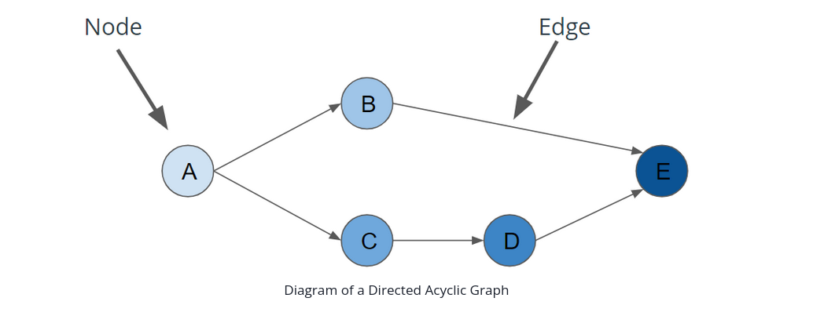

# 06- Airflow & Data Pipelines
_Udacity - Data Engineering Nanodegree_

## Directed Acyclic Graphs (DAGs)


- Directed: Work moves in one direction, from start to finish
  - (e.g., Node A in the image above has a relationship with Node B, but Node B does **NOT** have a relationship with Node A)
- Acyclic: No looping

---

## Introduction to Apache Airflow
Airflow is an open-source tool for creating DAG-based, schedulable data pipelines.
It also offers monitoring tools for visualising and evaluating the status of the pipeline.

With Airflow you can specify DAGs in languages like Python and run on schedules or external triggers. It has native integrations with Spark, Hadoop, Presto, AWS, and other tools (and offers development tools for creating more integrations).

To that point: **it's not a good idea to run any heavy code with Airflow - rather, Airflow should TRIGGER other tools** such as Spark or Redshift - which can do the heavy lifting.

**Question:** If a task in a DAG is simply triggering another script (like a webhook might) - how does the task then know that the other script has been completed and that subsequent tasks can start?

**Note:** Airflow will prioritize already-running tasks over new tasks. 
**Question:** Will Airflow prioritize the next task from an already-running DAG over starting a new DAG's first task?
---

## What makes up Airflow?

- **Scheduler** - for orchestrating jobs according to a schedule
- **Work Queue** - holds the state of running DAGS and tasks
- **Worker Processes** - execute the operations defined in each DAG
- **Metadata Database** - which saves credentials, connections, history, and configuration
- **Web UI** - provides control to user

---

## Airflow Operators

Airflow comes pre-built with certain 'operators' which allow you to perform certain operations very easily, including:
- Bash Operator (executes bash command)
- Python Operator (calls Python function)
- EmailOperator (sends an email)

Additionally, there are [community packages](https://airflow.apache.org/docs/apache-airflow-providers/index.html) that introduce additional operators, including:
- SimpleHttpOperator
- MySqlOperator
- MsSqlOperator
- PostgresOperator
- OracleOperator
- JdbcOperator
- DockerOperator
- HiveOperator
- S3FileTransformOperator
- PrestoToMySqlOperator
- SlackAPIOperator
- RedshiftToS3Operator
- S3ToRedshiftOperator
- etc...

---

## Airflow Dependency Defintions
In airflow we can define dependencies using `>>` and `<<` operators, as well as `set_upstream()` and `set_downstream()` methods.

Ex: Let's imagine that we have an ETL which looks like this:

```
        -> task_B
      /           \
task_A             -> task_D
      \           /
        -> task_C
```

To define these dependencies, we would need to use this code:

```
task_A >> task_B
task_A >> task_C

task_B >> task_D
task_C >> task_D
```

Or, in another way using the methods instead:

```
task_D.set_upstream(task_B)
task_D.set_upstream(task_C)

task_B.set_upstream(task_A)
task_C.set_upstream(task_A)
```

---

## Airflow Connections & Hooks
Airflow often has to integrate with external systems. To facilitate that, it has a **Connection** system for storing credentials that are used to talk to external systems.

A Connection is a set of parameters (e.g., username, password) - along with an ID to identify the Connection uniquely.

**Hooks** are high-level code to interface with an external platform and which lets you easily talk with this external platform without using low-level code like an API.

Hooks integrate with Connections to gather credentials for accessing these various platforms.

Existing hooks include the following, but custom hooks are also possible to code up:
- airflow.hooks.base_hook
- airflow.hooks.S3_hook
- airflow.hooks.dbapi_hook
- airflow.hooks.docker_hook
- airflow.hooks.druid_hook
- airflow.hooks.hdfs_hook
- airflow.hooks.hive_hook
- airflow.hooks.http_hook
- airflow.hooks.jdbc_hook
- airflow.hooks.mssql_hook
- airflow.hooks.mysql_hook
- airflow.hooks.oracle_hook
- airflow.hooks.pig_hook
- airflow.hooks.postgres_hook (also works with Redshift)
- airflow.hooks.presto_hook
- airflow.hooks.samba_hook
- airflow.hooks.slack_hook
- airflow.hooks.sqlite_hook
- airflow.hooks.webhdfs_hook
- etc...


- HttpHook
- PostgresHook (also works with red)