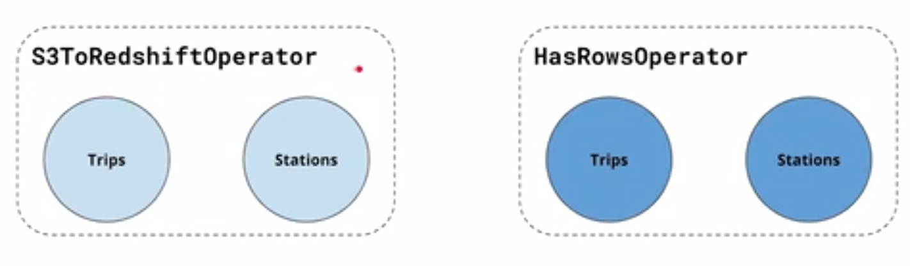

# 06- Airflow & Data Pipelines
_Udacity - Data Engineering Nanodegree_

## General tips on data pipeline creation

### Data Validation
When data pipelines are running automatically, there is no chance for manual oversight on whether everything is working correctly.
Therefore, it's critical to build in data checks. Stuff happens - maybe our copy job from S3 to Redshift just drops a few rows or
we forget that there are valid duplicate keys in our data set, but we run a `SELECT DISTINCT` and accidentally remove them.

> **NOTE:** I like the idea of 1-2 sense-checks in between steps of a data pipeline (e.g., check # of rows). This can maybe be visible
> in logs too and therefore give us way to check success of our steps.
> At critical junctures (e.g., just before producing an analyst-ready table), I like the idea of more checks - not only because
> this is where more complex operations like window functions or aggregations might happen - but also to prevent publication if anything fails.


---

## Directed Acyclic Graphs (DAGs)


- Directed: Work moves in one direction, from start to finish
  - (e.g., Node A in the image above has a relationship with Node B, but Node B does **NOT** have a relationship with Node A)
- Acyclic: No looping

---

## Introduction to Apache Airflow
Airflow is an open-source tool for creating DAG-based, schedulable data pipelines.
It also offers monitoring tools for visualising and evaluating the status of the pipeline.

With Airflow you can specify DAGs in languages like Python and run on schedules or external triggers. It has native integrations with Spark, Hadoop, Presto, AWS, and other tools (and offers development tools for creating more integrations).

To that point: **it's not a good idea to run any heavy code with Airflow - rather, Airflow should TRIGGER other tools** such as Spark or Redshift - which can do the heavy lifting.
This is because Airflow workers are not working on distributed systems, so they are limited to the memory and processing power on the machine Airflow is running on.

**Question:** If a task in a DAG is simply triggering another script (like a webhook might) - how does the task then know that the other script has been completed and that subsequent tasks can start?

**Note:** Airflow will prioritize already-running tasks over new tasks.
**Question:** Will Airflow prioritize the next task from an already-running DAG over starting a new DAG's first task?
---

## What makes up Airflow?

- **Scheduler** - for orchestrating jobs according to a schedule
- **Work Queue** - holds the state of running DAGS and tasks
- **Worker Processes** - execute the operations defined in each DAG
- **Metadata Database** - which saves credentials, connections, history, and configuration
- **Web UI** - provides control to user

---

## TaskFlow API
Taskflow is another way of defining Airflow resources (primarily DAGs) that is somewhat more intuitive.
Whereas with the traditional method of defining DAGs we need to instantiate a DAG object which is then passed
to operators, with the Taskflow API, we depend mostly on decorators to connect our Airflow objects.
We start with configuring the DAG decorator like in the example below at position "A".

Next, we can start to define functions which process data as we like as part of an Airflow DAG. We can denote these as tasks just with the `@task` decorator.
However, these all need to be WITHIN a parent function which defines the DAG (see position "B") below.

Once all of our tasks are defined, we can create a script just like we would running Python normally (see position "C" below). In this way, we can more-or-less write Python code as normal and then add the decorators to 'translate' the script for Airflow to use.

After we've defined this, we invoke the encompassing dag function (position "D") to denote to Airflow what to actually run.


```python
import json
import pendulum
from airflow.decorators import dag, task

#Position A. Configuring DAG:
@dag(
    schedule=None,
    start_date=pendulum.datetime(2021, 1, 1, tz="UTC"),
    catchup=False,
    tags=["example"]
)
def my_new_dag():

  #------------
  @task()
  def extract():
    '''
    Basic function to get data and return it for use later in the DAG.
    '''
      data_string = '{"1001": 301.27, "1002": 433.21, "1003": 502.22}'
      order_data_dict = json.loads(data_string)
      return order_data_dict

  #------------
  @task(multiple_outputs=True)
  def transform(order_data_dict: dict):
      """
      #### Transform task
      A simple Transform task which takes in the collection of order data and computes the total order value.
      """
      total_order_value = 0

      for value in order_data_dict.values():
          total_order_value += value

      return {"total_order_value": total_order_value}

  #------------
  @task()
  def load(total_order_value: float):
      """
      #### Load task
      A simple Load task which takes in the result of the Transform task and
      instead of saving it to end user review, just prints it out.
      """

      print(f"Total order value is: {total_order_value:.2f}")

  #Pos. C: Writing script (just like Python code)
  order_data = extract()
  order_summary = transform(order_data)
  load(order_summary["total_order_value"])

#Pos. D: Activating the DAG:
tutorial_taskflow_api()
```

**Note about return values:**
There is an important caveat to how Airflow is working with the function calls above (e.g., `extract()`). Namely, Airflow is letting us write what feels like normal Python code, but Airflow is **not running this code as normal Python code**. For instance, the result of `extract()` is supposed to be saved in the `order_data` variable above, but this is not what's happening.
Rather, **Airflow is reading this code to understand the dependencies between our code.**
Thus, the `order_data` variable is just a representation of a task, and we're telling Airflow that the `transform` function needs the result of that task, and that there is a dependency between `transform` and `extract`. This is not necessarily different from how Python interprets these objects, but Airflow is also doing it to build a DAG.

If we want to define dependencies where no 'results' are being passed, we can still use the typical `>>` notation to depict this, **but we do this with the 'return' values - which are really just references to the tasks - we do not use the names of the functions for defining this dependency**:
`order_data >> order_summary`

See the `l2_e3_task_dependencies.py` file in this directory for an example.


---

## Airflow Operators
You can think of operators as actual components of a data pipeline - the individual 'nodes' that make up a DAG. So we can do think of operators as simply 'what we can do in our data pipeline. For exxample, we can use the `SimpleHttpOperator` to call an API that returns how many records we have in a remote file storage. Then, we can call a `Postgres Operator` to command Postgres to read in data from this remote file store and passing the required URL.
Once the data is in Postgres, we can run more commands with the `PostgresOperator` to ensure the data was truly fully loaded (does the # of records match from the http call to postgres?).
Next, we might want to load these data into a Spark job, so we could use an AWS operator to load these data to S3, and then another AWS job to trigger a Glue job, etc.

Airflow comes pre-built with certain 'operators' which allow you to perform certain operations very easily, including:
- Bash Operator (executes bash command)
- Python Operator (calls Python function)
- EmailOperator (sends an email)

Additionally, there are [community packages](https://airflow.apache.org/docs/apache-airflow-providers/index.html) that introduce additional operators, including:
- SimpleHttpOperator
- MySqlOperator
- MsSqlOperator
- PostgresOperator
- OracleOperator
- JdbcOperator
- DockerOperator
- HiveOperator
- S3FileTransformOperator
- PrestoToMySqlOperator
- SlackAPIOperator
- RedshiftToS3Operator
- S3ToRedshiftOperator
- etc...

---

## Airflow Dependency Defintions
In airflow we can define dependencies using `>>` and `<<` operators, as well as `set_upstream()` and `set_downstream()` methods.

Ex: Let's imagine that we have an ETL which looks like this:

```
        -> task_B
      /           \
task_A             -> task_D
      \           /
        -> task_C
```

To define these dependencies, we would need to use this code:

```
task_A >> task_B
task_A >> task_C

task_B >> task_D
task_C >> task_D
```

---

## Airflow Connections
Airflow often has to integrate with external systems. To facilitate that, it has a **Connection** system for storing credentials that are used to talk to external systems.

A Connection is a set of parameters (e.g., username, password) - along with an ID to identify the Connection uniquely.
Each connection is required to have a 'type' which tells Airflow how to pass along the credentials to a specific service. These include (but not limited to):
- Amazon Web Services Connection
- Google Cloud Platform Connection
- Google Cloud SQL Connection
- gRPC
- MySQL Connection
- Oracle Connection
- PostgresSQL Connection
- SSH Connection


Airflow hooks are preconfigured (if they need it) to pull connection information directly from Airflow:
```python
hook = S3Hook(aws_conn_id='aws_credentials')
```
However, you can also interface with the credentials directly by using Airflow's built-in "MetastoreBackend:
```python
from airflow.secrets.metastore import MetastoreBackend

metastore = MetastoreBackend()
aws_conn = metastore.get_connection("aws")

logging.info(aws.conn.login)
logging.info(aws.conn.password)
```

---

## Airflow Hooks

**Hooks** are high-level code to interface with an external platform and which lets you easily talk with this external platform without using low-level code. **Hooks are basically API wrappers, so if an API exists that is Python-accessible (e.g., an HTTP API), you could write a custom hook based on it**

> **NOTE:** You need to create an access key in AWS to use Airflow hooks, and this access key MUST be configured as 'for use in external applications'. I tried to use the master access key I had used for local development, but it didn't work.

Hooks integrate with Connections to gather credentials for accessing these various platforms.

> **NOTE:** It looks like that hooks use connections to set up a link with the desired service. Then, your operator can use this connection to do what it needs to do - so hooks + connections are just ways to conveniently abstract these common (and necessary) operations so that your operators can just focus on the actual task to be done.
> For example, our `PostgresHook` has the built-in method `.get_pandas_df("SELECT * FROM myTable")` - so we can actually do common operations AND connect with this hook class - very convenient!

Existing hooks include the following, but custom hooks are also possible to code up:
- airflow.hooks.base_hook
- airflow.hooks.S3_hook
- airflow.hooks.dbapi_hook
- airflow.hooks.docker_hook
- airflow.hooks.druid_hook
- airflow.hooks.hdfs_hook
- airflow.hooks.hive_hook
- airflow.hooks.http_hook
- airflow.hooks.jdbc_hook
- airflow.hooks.mssql_hook
- airflow.hooks.mysql_hook
- airflow.hooks.oracle_hook
- airflow.hooks.pig_hook
- airflow.hooks.postgres_hook (also works with Redshift)
- airflow.hooks.presto_hook
- airflow.hooks.samba_hook
- airflow.hooks.slack_hook
- airflow.hooks.sqlite_hook
- airflow.hooks.webhdfs_hook
- etc...

---

## Airflow Variables

### User variables
The user can set up variables in Airflow to provide configuration details to one or more DAGs.
These can be set up in docker quite like this:
`sudo -S docker-compose run airflow-worker airflow variables set test_variable {\"test_key\":\"test_val\"}`

Once these are set up in Airflow, they can be accessed in the context of Airflow DAGs using the following code:
```python
from airflow.models import Variable

source_bucket = Variable.get('source_s3_bucket')
file_type = Variable.get('source_file_type')
```

We can also configure variables in the Dag like this:
```python
from airflow.models import Variable
Variable.set(key='source_s3_bucket',value="s3://data-bucket-kstine/customers", description="Bucket o' source data")
```

>**IMPORTANT NOTE:** These variables are NOT held persistently - they only exist during the runtime of Airflow. If Airflow stops running these variables (as well as Connection data) are lost.
> This suggests that we might want to specify Variables and Connections as IaC configurations, which can be easily re-loaded into Airflow should it ever fail.
> Maybe this could even be another DAG...

---

### Context variables
Airflow context variables allow you to get runtime information of the DAG *within the application run within your DAG*
So if we want to put the DAG run_id in our application code and put it in logging messages, we can do that.

**Important: 'execution_date' prints the execution date- what this means is *the date on which the DAG was SUPPOSED to be run*.**
If you have backlogged your DAG to run since a date in the past, this will show PAST dates. This can be great for using this
variable to split data (e.g., each month, import data from previous month and figure out what the previous month was by looking
at the 'ds' variable from the DAG execution)

> **NOTE: These DAG environment variables can change. See [here](https://airflow.apache.org/docs/apache-airflow/stable/templates-ref.html) for the most up-to-date version.**

---

## Data Lineage
Data Lineage describes the entire path of how data is created, transformed and stored.
This could be thought of as a transformation sequence - a list of commands performed on data that take it from A -> B.
However, rather than *performing* these steps, "Data Lineage" is often recorded to build understanding (and confidence) in data.
For this reason (also to help communicate with non-programmers) data lineage is often **graphical** as it is in DAG graphs.

---

## Good Scheduling Practices
Regularly recurring pipelines which ingest data should aim to ingest only all data since the last run. For example, a weekly-run dag should probably process only (new) data from the past week.
This is where getting the 'Context' like in `sample_dag3.py` is helpful.

Also, the **size** of the data can help us understand how often to run our pipelines. Maybe if we don't want our DAGs running for
hours, we need to process data more frequently (and in smaller chunks).

Another useful feature of Airflow is that **DAGs can have end dates**. This is nifty because it lets us set up sunsets for
older pipelines and have the newer pipelines start immediately afterwards - no manual work required!

e.g.:
```python
@dag(
    start_date=pendulum.datetime(2022, 8, 1, 0, 0, 0, 0),
    end_date=pendulum.datetime(2022, 9, 1, 0, 0, 0, 0),
    schedule_interval='@daily',
    #If there is ever a case when we could run >1 DAG at a time (e.g., backfilling), how many concurrent DAGs do we want?
    #For example, if analyses from May depend on analyses from April, we can't run April + May DAGs concurrently.
    ,max_active_runs=1
  )
```

>Note: If you remove the historical logs of DAG runs, that can trigger Airflow to **RE-RUN (BACKFILL) YOUR DAGS** because it thinks that these DAGs never ran!! **Be careful when clearing old DAG log data**

---

## Data Partitioning
Data partitioning has a host of advantages, including:
- Limiting the amount of data processed at one single time
- Allowing greater parallelization of tasks
- Allowing more robust backups / distribution of data

**Logical Partitioning**: Partitioning based on the information being dealt with. For example, 'customers' should be processed separately from 'employees', even though they may have some fields in common.

**Size Paritioning**: Partitioning based on the size of the data to be processed (e.g., in to 1-GB chunks)

>**How to partition with Airflow?**<br>
Since Airflow DAGs should be designed to simply *trigger* work on other machines (e.g., give a command to Redshift to copy from S3), Airflow partitioning is really a task of partitioning in other systems.<br>
For example, if we were to send COPY commands to Redshift to get data from S3, we could tell Airflow to send COPY commands which only reflect partitions of the data (e.g., `COPY FROM s3://march` , `COPY FROM s3://april`). So we could 'inject' relevant partitioning details into the commands we send out to other tools with Airflow.<br>
**NOTE:** This is an argument for making our triggered jobs quite simple - but with a lot of configurable options. Then we can simply configure our DAGs to change our our jobs behave, rather than having to go into each job to make configurations manually.
---

## DAG Templating
Airflow has some special operators which allow you to enter context information directly into your DAGs.
This format looks like this: `{{ execution_date }}`.
When Airflow runs this Python script, *it will automatically inject the variables into your code*

Let's say we have some SQL which will be run on Redshift to process a specific table. When we run our DAG, we can
inject partitioning information (e.g., year, data type)

```python
COPY_SQL = """
COPY trips
FROM 's3://test/repo/{year}/{month}'
ACCESS_KEY_ID 'access_key_here'
SECRET_ACCESS_KEY 'secret_key_here'
IGNOREHEADER 1
DELIMITER ','
"""

date = datetime({{ execution_date }})
COPY_SQL.format(date.year, date.month)
```

This kind of double-curly bracketing seems to be related to the templating engine "Jinja" (also available as a Python module).
**TODO: Look into Jinja more and see if this is what's going on here or not...**
[more info on jinja here](https://realpython.com/primer-on-jinja-templating/)

> **UPDATE for Taskflow:** It looks like Taskflow has hugely revamped how templating works. Rather than using Jinja templating to insert DAG run details, we can now instead **just use kwargs**. This is great- we just pass the `**kwargs` argument explicitly to the DAG function definition, and then we can use all of the DAG environment variables directly in our nested tasks (this is just how Python variable scopes work). Delightful!

```python
from airflow.decorators import dag, task

@dag(
  schedule_interval="@daily";
)
def template_dag(**kwargs):

  @task
  def hello_date():
    print(f“Hello {kwargs['ds']}}”)

```

---

## Ways to measure data quality (in Airflow and elsewhere)
Some common ways to measure data quality are:
- Data must be a **certain size** (and no larger)
- Data must be accurate to **some margin of error**
- Data must arrive within a given timeframe
- Pipelines must not take too long to run
- Data must contain all required information and no additional (particularly sensitive) information


## Monitoring & Service-level agreements (SLAs)
Airflow offers **SLAs** to allow the user to specify fail criteria that Airflow can use in monitoring our DAGs and flagging violations. This is most often defined as **a time limit within a DAG must complete.**

Airflow can be configured to send emails based on DAG and state changes.
> **QUESTION:** Can I also ask Airflow to trigger another DAG based on SLA violations (e.g., a DAG which sends Slack AND email notifications, and logs the DAG output error to an internal notice board)?

Airflow also offers the native ability to send system metrics with a system called **statsd**. Airflow can also be integrated with **Prometheus** (open source monitoring system) and **Grafana**.
While Airflow automatically writes local logs, you can forward these logs elsewhere using tools like [**fluentd**](https://www.fluentd.org/))


---

## Extending Airflow with custom plugins, operators
Airflow is built to be extensible.<br>
While there are many ways to extend Airflow, the most common types of custom plug-ins are **hooks** and **operators**
>Note: Making a custom operator / hook would be a great part of my final project...

**Example of custom operator**
In the Airflow lessons, I've been working on building a data pipeline between S3 and Redshift. This encompasses:
1. Creating tables
2. Copying data from S3 to tables
3. Checking data transfer

We can take these operations and **make custom operators out of them** so that future work which needs to do the same thing can simply re-use our operators, rather than re-defining this same type of pipeline, for example:


<br /><br />

With custom operators (and hooks), they just need to be in the 'plugins' folder of the Airflow directory to be picked up and usable by DAGs.

### Note on custom operators + Jinja templating:
There is a feature often referenced in Airflow documentation called "Jinja templating".
It seems to be a way we can take environment variables present at runtime and insert them into our code.
The example below from [this Airflow docs page](https://airflow.apache.org/docs/apache-airflow/stable/howto/custom-operator.html) shows how to implement a custom operator with `template_fields` so that these variables can be used in custom operators:
```
class HelloOperator(BaseOperator):

    template_fields: Sequence[str] = ("name",)

    def __init__(self, name: str, **kwargs) -> None:
        super().__init__(**kwargs)
        self.name = name

    def execute(self, context):
        message = f"Hello from {self.name}"
        print(message)
        return message
```
---

```
with dag:
    hello_task = HelloOperator(task_id="task_id_1", dag=dag, name="{{ task_instance.task_id }}")
```

**My questions on this:**
1. If we use the templating string `{{ task_instance.task_id }}` as the argument to instantiating the class, then I would assume the class itself has no knowledge of of the templating. **Why do we also have to define templating within the class?**

---

## Designing better Airflow task boundaries

---

## Sub-DAGs + re-using DAGs

---

## Monitoring Airflow jobs

---

## Other Airflow resources:
- Cool repo in which DAGS are specified to *maintain Airflow* (e.g., deleting old logs once per week, etc.)
  - https://github.com/teamclairvoyant/airflow-maintenance-dags

**NOTE: Look at Jenkins and Crontab for other scheduling tools!**